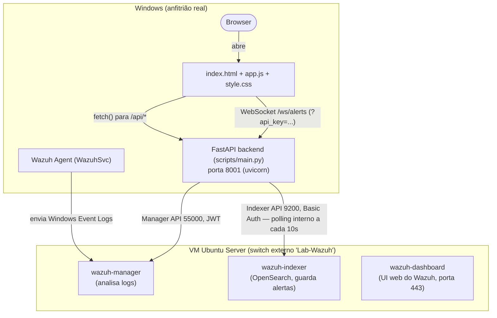

# 🔒 SentryLens

**Dashboard de Cibersegurança — Projeto CET (curso de cibersegurança)**

<p align="center">
  
</p>

<p align="center">
  
  
  
  
</p>

SentryLens é um dashboard que liga a um laboratório Wazuh real (SIEM
open-source) e mostra, em tempo quase-real, os alertas de segurança
gerados pelos Windows Security Event Logs de uma máquina monitorizada —
com nome amigável, severidade e recomendação de ação para cada tipo de
evento, em vez de IDs numéricos crus.

O projeto tem duas fases que partilham a mesma lógica de classificação:

| Fase | O que faz | Onde está |
|---|---|---|
| **Fase 1** | Analisa ficheiros de log estáticos (JSON ou CSV) e gera um relatório HTML | [`log_analyzer.py`](log_analyzer.py) — ver [`QUICKSTART.md`](QUICKSTART.md) |
| **Fase 2** *(este repo)* | Liga-se ao vivo a um laboratório Wazuh (VirtualBox/Hyper-V) via API e mostra os alertas num dashboard web | `scripts/` (backend) + `index.html` / `app.js` / `style.css` (frontend) |

A classificação de Event ID → nome amigável / severidade / recomendação
é a mesma lógica da Fase 1, centralizada em `scripts/event_catalog.py`.

### Stack técnica

| Camada | Tecnologia |
|---|---|
| Backend | Python 3.12+, [FastAPI](https://fastapi.tiangolo.com/) 0.115.0, Uvicorn 0.32.0 |
| Integração SIEM | Wazuh (Manager API + Indexer API/OpenSearch) via `httpx` |
| Tempo real | WebSocket nativo do FastAPI (`/ws/alerts`) |
| Persistência | JSONL (histórico bruto/conformidade) + SQLite (índice de consulta) |
| Machine Learning | scikit-learn 1.5.2 (Isolation Forest) |
| Frontend | HTML/CSS/JavaScript puro (sem framework nem build step), Chart.js |
| Testes | 12 scripts standalone (`scripts/test_*.py`) — sem pytest, ver [Testes](#-testes) |
| SO alvo | Windows 10/11 (WMI/PowerShell para specs do sistema) |

---

## Arquitetura



O backend nunca fala diretamente com o agente — consulta as duas APIs do
Wazuh Manager/Indexer, que já têm os alertas processados.

> ⚠️ A VM `Wazuh-Manager` usada neste PC corre em **VirtualBox**
> (`VBoxManage list vms` confirma-o), não em Hyper-V — os scripts de
> setup (`setup-hyperv-lab.ps1`) e o guia
> [`docs/LAB_WAZUH_HYPERV.md`](docs/LAB_WAZUH_HYPERV.md) descrevem o
> caminho Hyper-V, mas endpoints/portas/credenciais são iguais em
> qualquer um dos dois hypervisors; só o arranque automático (ver
> [Arranque automático](#-arranque-automático)) usa `VBoxManage`.

---

## Funcionalidades

- Dashboard web com 9 abas — ver tabela em [Servir o frontend](#3-servir-o-frontend).
- Classificação de 23 Event IDs do Windows Security Log em nome
  amigável + severidade + recomendação — ver
  [`docs/API.md`](docs/API.md#catálogo-de-event-ids-scriptsevent_catalogpy).
- Atualização em tempo real por WebSocket (`/ws/alerts`), com fallback
  automático para polling a cada 30s se a ligação falhar.
- Autenticação por API key em todos os endpoints `/api/*`.
- Persistência própria de histórico de alertas (JSONL + índice SQLite),
  para além dos 90 dias de retenção do Wazuh Indexer.
- Exportação de relatório HTML autónomo (`GET /api/export/report`).
- Avaliação de conformidade regulatória (RGPD/NIS2/AI Act) por alerta.
- Classificação NIS2 sugerida a partir de CAE/colaboradores/faturação
  já conhecidos (sem pesquisa automática online).
- Deteção de anomalias por Machine Learning (Isolation Forest), lado a
  lado com a classificação por regras.
- Monitorização detalhada do sistema local (CPU, RAM, disco físico por
  modelo/SSD-HDD, rede) via WMI/PowerShell.
- Arranque automático configurado neste PC (VM + backend + frontend, ao
  iniciar sessão) — ver [secção dedicada](#-arranque-automático).

> ⚠️ Sem distinção entre múltiplos utilizadores — a API key é
> partilhada, não é login (ver [Próximos passos](#-próximos-passos)).

---

## 📁 Estrutura do repositório

```
Dashboard cybersec/
├── README.md                    ← este ficheiro
├── CLAUDE.md                    ← instruções do projeto para o Claude Code
├── index.html / app.js / style.css ← frontend
├── logo.png
│
├── log_analyzer.py              ← Fase 1: analisa logs estáticos, gera relatório HTML
├── sample_events.json / report.html / report.json / QUICKSTART.md ← Fase 1
├── HARDENING_CHECKLIST.md       ← checklist de hardening Windows, referência autónoma
├── INCIDENT_RESPONSE.md         ← playbook de resposta a incidentes, referência autónoma
│
├── scripts/                     ← backend FastAPI + automação do laboratório
│   ├── main.py                  ← app FastAPI, endpoints REST + WebSocket
│   ├── wazuh_client.py          ← cliente para Manager API + Indexer API
│   ├── event_catalog.py         ← classificação de Event IDs
│   ├── websocket_alerts.py      ← ConnectionManager + alert_poll_loop (/ws/alerts, 10s)
│   ├── history_store.py         ← persistência JSONL (alerts.jsonl, compliance.jsonl)
│   ├── history_index.py         ← índice SQLite sobre o histórico
│   ├── compliance_evaluator.py / compliance_rules.yaml / org_profile.py ← motor RGPD/NIS2/AI Act
│   ├── nis2_lookup.py           ← classificação NIS2 sugerida (sem scraping)
│   ├── report_generator.py      ← gerador de relatório HTML autónomo
│   ├── lifecycle.py / rbac.py / admin_activity.py ← painéis de ciclo de vida/RBAC/admin
│   ├── ml_anomalies.py / feature_extractor.py / train_anomaly_model.py ← deteção por ML
│   ├── system_monitor.py        ← specs/saúde da máquina local
│   ├── test_*.py                ← 12 scripts de teste standalone (ver Testes)
│   ├── requirements.txt         ← dependências Python do backend
│   ├── .env / .env.example      ← credenciais reais (não versionar) / template
│   ├── README.md                ← guia dos scripts de automação do laboratório
│   ├── setup-hyperv-lab.ps1     ← 1) cria Hyper-V switch + VM (Windows, Admin)
│   ├── install-wazuh.sh         ← 2) instala o Wazuh dentro da VM (via SSH)
│   ├── install-wazuh-agent.ps1  ← 3) instala o agente no Windows (Admin)
│   ├── start-backend.ps1 / start-frontend.ps1 ← wrappers das tarefas agendadas
│   └── historico/ · models/     ← dados gerados em runtime (gitignored)
│
└── docs/
    ├── README.md                ← guia legado (estrutura antiga) — ver aviso no topo do ficheiro
    ├── LAB_WAZUH_HYPERV.md      ← guia passo-a-passo do laboratório (VirtualBox e Hyper-V)
    ├── API.md                   ← documentação completa da API
    ├── ML.md                    ← deteção de anomalias por Machine Learning
    └── TROUBLESHOOTING.md       ← lista completa de problemas conhecidos
```

---

## ✅ Pré-requisitos

- Windows 10/11 Pro, Enterprise ou Education (Hyper-V não existe na
  edição Home) — ou VirtualBox, se seguires o caminho usado neste PC.
- Virtualização de hardware (Intel VT-x / AMD-V) ativa na BIOS/UEFI.
- Python 3.12+ instalado e no PATH.
- Uma VM Ubuntu Server 22.04 LTS com Wazuh instalado, acessível na
  rede local (ver secção seguinte).

---

## 1. Montar o laboratório Wazuh

Guia completo: [`docs/LAB_WAZUH_HYPERV.md`](docs/LAB_WAZUH_HYPERV.md).
Resumo dos 3 scripts automatizados, **corridos manualmente por esta
ordem** (nunca em automático — envolvem reiniciar o PC e mexer em
virtualização):

| # | Script | Onde corre | O que automatiza |
|---|---|---|---|
| 1 | `scripts/setup-hyperv-lab.ps1` | Windows anfitrião (PowerShell, Admin) | Ativa Hyper-V, cria o Virtual Switch `Lab-Wazuh` (externo) e a VM (Geração 2, 8 GB RAM, 4 vCPU, 60 GB disco dinâmico, Secure Boot desativado) |
| — | *(manual)* instalação do Ubuntu Server | Consola Hyper-V | Interativo de propósito — idioma, disco, utilizador, e marcar **"Install OpenSSH server"** |
| 2 | `scripts/install-wazuh.sh` | Dentro da VM Ubuntu (via SSH) | `apt update/upgrade`, `wazuh-install.sh -a`, mostra as passwords geradas, confirma manager/indexer/dashboard `active (running)` |
| — | *(manual)* login no Dashboard Wazuh | Browser do Windows | `https://<IP_DA_VM>` → aceitar certificado autoassinado → login `admin` |
| 3 | `scripts/install-wazuh-agent.ps1 -WazuhManagerIP <IP_DA_VM>` | Windows a monitorizar (PowerShell, Admin) | Descarrega o MSI do agente, instala silenciosamente, arranca `WazuhSvc`, confirma `Running` |
| — | *(manual)* validação final | Wazuh Dashboard | Management → Endpoints → agente `Active`; gerar logon falhado de propósito e confirmar `rule.id 60122` / Event ID `4625` em Threat Hunting |

Detalhes de cada parâmetro (`Get-Help .\setup-hyperv-lab.ps1 -Full`) e a
lista de passos propositadamente **não** automatizados estão em
[`scripts/README.md`](scripts/README.md).

---

## 2. Configurar e correr o backend

```bash
cd scripts
pip install -r requirements.txt
cp .env.example .env    # depois editar com os valores reais
```

Editar `scripts/.env`:

```env
# Wazuh Manager API (porta 55000)
WAZUH_MANAGER_URL=https://<IP_DA_VM>:55000
WAZUH_MANAGER_USER=wazuh-wui
WAZUH_MANAGER_PASSWORD=<password real>

# Wazuh Indexer API (porta 9200)
WAZUH_INDEXER_URL=https://<IP_DA_VM>:9200
WAZUH_INDEXER_USER=admin
WAZUH_INDEXER_PASSWORD=<password real>

# Obrigatória — sem ela, todos os pedidos a /api/* são recusados com 401
SENTRYLENS_API_KEY=<gerar, ver secção Autenticação por API key>
```

Ambas as passwords do Wazuh vêm do ficheiro gerado durante a instalação
(dentro da VM):

```bash
sudo tar -O -xvf wazuh-install-files.tar wazuh-install-files/wazuh-passwords.txt
```

Correr o backend:

```bash
uvicorn main:app --reload --port 8001
```

Confirmar que está de pé:

```bash
curl -H "X-API-Key: <a tua SENTRYLENS_API_KEY>" http://localhost:8001/api/health
# {"status":"ok","timestamp":"2026-08-28T21:47:37.019106"}
```

Sem o header, este pedido devolve `401`.

> Não há documentação interativa (Swagger/`/docs`) — desativada de
> propósito (`docs_url=None` em `main.py`), porque as rotas automáticas
> do FastAPI não passam pela mesma proteção de API key das rotas
> registadas via `@app.get`/`@app.post`.

### Nota sobre a porta 8000

Neste PC, a porta 8000 já está ocupada por um serviço Windows de
terceiros (`httpd.exe`, serviço `IBXDashboard`, sem relação com este
projeto) — por isso o backend usa **8001** como porta default.

---

## 🚀 Arranque automático

Configurado neste PC para que, ao iniciar sessão, tudo suba sozinho:

| # | O quê | Onde | Como |
|---|---|---|---|
| 1 | VM `Wazuh-Manager` arranca em headless | Windows Task Scheduler | Tarefa `Wazuh-Manager-VM`, `VBoxManage startvm "Wazuh-Manager" --type headless` |
| 2 | `wazuh-manager` resiste a falhar no boot | VM (systemd override) | `Restart=on-failure`, `RestartSec=15` (mitiga race condition com o Indexer a arrancar ao mesmo tempo) |
| 3 | Backend FastAPI arranca em segundo plano | Windows Task Scheduler | Tarefa `SentryLens-Backend`, corre `scripts/start-backend.ps1` (logs em `scripts/backend.log`) |
| 4 | Frontend arranca e abre no browser | Windows Task Scheduler | Tarefa `SentryLens-Frontend`, atraso de 10s, corre `scripts/start-frontend.ps1` (logs em `scripts/frontend.log`) |

Gerir as tarefas: `Get-ScheduledTask -TaskName "SentryLens-Backend","SentryLens-Frontend","Wazuh-Manager-VM"`
no PowerShell, ou pela app "Agendador de Tarefas" do Windows.

É normal, nos primeiros 1–3 minutos depois do login, os endpoints
devolverem `502` enquanto a VM e os serviços Wazuh ainda estão a
arrancar.

---

## 3. Servir o frontend

O frontend é HTML/CSS/JS puro, na raiz do repo. `app.js` aponta para
`API_BASE = "http://localhost:8001"`.

**Opção A — automático (já configurado neste PC):** a tarefa
`SentryLens-Frontend` serve o frontend em `localhost:5500` e abre o
browser sozinha — ver [Arranque automático](#-arranque-automático).

**Opção B — servidor estático manual:**

```bash
python -m http.server 5500
```

Depois abrir `http://localhost:5500/index.html`.

**Opção C — abrir diretamente (não recomendado):** duplo-clique em
`index.html` não funciona — o CORS do backend está restrito a
`localhost`/`127.0.0.1`, e `file://` envia `Origin: null`, que essa
restrição não reconhece de propósito. Usa a Opção A ou B.

O dashboard liga-se por WebSocket ao carregar a página e atualiza-se
imediatamente quando chega um alerta novo (ver [WebSocket em tempo
real](#-websocket-em-tempo-real-wsalerts)); o polling fixo de 30s
continua a existir só como *fallback*. O indicador no canto superior
direito mostra **● ligado ao Wazuh** (verde) ou **● sem ligação**
(vermelho, consultar a consola do browser para o erro exato).

A interface está organizada em 9 abas:

| Aba | Conteúdo |
|---|---|
| 📊 **Visão Geral** | KPIs (total/severidade/agentes ativos), resumo do sistema, gráficos de análise |
| 🚨 **Alertas** | Banner de força bruta + tabela densa com todos os campos de cada alerta |
| 🖥️ **Agentes** | Tabela de agentes Wazuh — nome, IP, SO, estado, último keep-alive |
| ⚙️ **Sistema** | CPU/RAM/disco/rede desta máquina em detalhe, interfaces de rede, histórico de violações |
| 📋 **Ciclo de Vida** | Contagens, timeline e deteções de risco no ciclo de vida de contas |
| 🔑 **Privilégios** | Desvios RBAC — grupos atribuídos fora do baseline cargo→grupos permitidos |
| 👤 **Contas Admin** | Atividade de contas administrativas — privilégios especiais, tarefas agendadas |
| 🧠 **ML Anomalias** | Deteção por Isolation Forest lado a lado com a classificação por regras |
| 🛡️ **Conformidade** | Veredito RGPD/NIS2/AI Act por alerta, resumo agregado, perfil da organização |

---

## 🧪 Testes

Sem laboratório Wazuh ligado — tudo mockado (`AsyncMock` sobre
`WazuhIndexerClient`/`WazuhManagerClient`). Sem framework (nem pytest):
12 scripts standalone em `scripts/`, cada um imprime `[OK]`/`[FALHOU]`
por caso e sai com `sys.exit(1)` se algo falhar.

```bash
cd scripts
python test_with_mock.py         # classificação, /api/stats, /api/brute-force
python test_new_panels.py        # /api/lifecycle, /api/privileges, /api/admin-activity
python test_ml_anomalies.py      # /api/ml-anomalies
python test_auth.py              # autenticação por API key (401/200, /docs desligado)
python test_websocket_alerts.py  # /ws/alerts — auth por query param, _poll_once
python test_history_store.py     # persistência JSONL de histórico
python test_history_index.py     # índice SQLite + /api/history/query
python test_compliance.py        # motor RGPD/NIS2/AI Act + /api/compliance
python test_nis2_lookup.py       # classificação NIS2 sugerida + /api/nis2-lookup
python test_report_generator.py  # gerador + /api/export/report
python test_system_monitor.py    # THRESHOLDS + /api/system/thresholds
python test_feature_extractor.py # extração de features de ML (não usa TestClient)
```

Todos definem `SENTRYLENS_API_KEY` em `os.environ` **antes** de
`import main` e fazem `main.app.router.on_startup.clear()` para não
arrancar os loops de background. Correm no `.venv` de `scripts/` — o
Python global desta máquina não tem `scikit-learn`/`joblib`/`PyYAML`
instalados.

---

## 4. Endpoints da API

Todos os endpoints `/api/*` exigem uma API key (`X-API-Key`) e devolvem
JSON, exceto `GET /api/export/report` (devolve HTML para download).
CORS restringido a origens loopback. Documentação completa —
autenticação, WebSocket, histórico/SQLite, conformidade, NIS2 lookup,
parâmetros de cada endpoint e o catálogo de 23 Event IDs — em
**[`docs/API.md`](docs/API.md)**.

| Method | Endpoint | Descrição |
|---|---|---|
| GET | `/api/health` | Confirma que o backend está de pé |
| GET | `/api/agents` | Lista de agentes Wazuh e estado atual |
| GET | `/api/alerts` | Alertas recentes, classificados |
| GET | `/api/stats` | KPIs agregados |
| GET | `/api/brute-force` | Deteção de força bruta (Event ID 4625) |
| GET | `/api/ml-anomalies` | Deteção por Isolation Forest vs. regras — ver [docs/ML.md](docs/ML.md) |
| GET | `/api/export/report` | Relatório HTML autónomo (download) |
| GET | `/api/compliance` | Veredito RGPD/NIS2/AI Act por alerta |
| GET | `/api/nis2-lookup` | Classificação NIS2 sugerida (CAE/colaboradores/faturação) |
| GET | `/api/history/query` | Consulta o histórico via índice SQLite |
| GET | `/api/lifecycle` \| `/api/privileges` \| `/api/admin-activity` | Ciclo de vida de contas, desvios RBAC, atividade admin |
| WS | `/ws/alerts` | Push de alertas novos em tempo real (auth por query param) |
| GET | `/api/system/*` | Specs, alertas, histórico e thresholds do sistema local |
| POST | `/api/system/speedtest` | Força medição de velocidade de rede |

---

## 5. Deteção de anomalias por Machine Learning

O painel **🧠 ML Anomalias** usa um `IsolationForest` (scikit-learn)
lado a lado com a classificação por regras, como segundo ponto de
vista sobre os mesmos alertas.

> ⚠️ **Nada disto foi treinado ou validado com dados reais do
> laboratório** — o modelo é treinado sobre um fixture sintético.

Retreinar: `cd scripts && python train_anomaly_model.py`. Metodologia,
features, resultados (precisão/recall/F1) e o ciclo de validação com
dados reais (`attack_scenarios.py` + `export_snapshot.py`) em
**[`docs/ML.md`](docs/ML.md)**.

---

## 🐛 Troubleshooting

Os 3 problemas mais comuns:

- **"● sem ligação" no frontend / erro 502** → confirma que o backend
  está a correr (`uvicorn main:app --port 8001`) e que a VM Wazuh está
  ativa (`VBoxManage list runningvms`).
- **401 Unauthorized** → `SENTRYLENS_API_KEY` não definida em
  `scripts/.env`, ou diferente da constante `API_KEY` em `app.js`.
- **`uvicorn` falha na porta 8000** → usa `--port 8001` (ver [Nota
  sobre a porta 8000](#nota-sobre-a-porta-8000)).

Lista completa (CORS, WebSocket, VM sem resposta na rede, nenhum
alerta a aparecer, etc.) em
**[`docs/TROUBLESHOOTING.md`](docs/TROUBLESHOOTING.md)**.

---

## 🚀 Próximos passos

1. **Autenticação multi-utilizador** — a API key partilhada já bloqueia
   acesso não autenticado na rede local, mas não distingue
   utilizadores; para produção real, evoluir para login por utilizador
   (ex: JWT).
2. **Pesquisa automática de dados para a classificação NIS2** — a
   lógica de decisão a partir de CAE/colaboradores/faturação já
   conhecidos está feita (`scripts/nis2_lookup.py` +
   `GET /api/nis2-lookup`); falta ir buscar esses dados automaticamente
   a partir de um NIPC (ex: Racius, informacaoempresarial.pt) e ligar o
   resultado a `org_profile.py`, hoje fixo.

---

## 📚 Referências

- [`docs/API.md`](docs/API.md) — documentação completa da API (autenticação, WebSocket, histórico, conformidade, NIS2, catálogo de Event IDs).
- [`docs/ML.md`](docs/ML.md) — deteção de anomalias por Machine Learning (metodologia, resultados, retreino).
- [`docs/TROUBLESHOOTING.md`](docs/TROUBLESHOOTING.md) — lista completa de problemas conhecidos.
- [`docs/LAB_WAZUH_HYPERV.md`](docs/LAB_WAZUH_HYPERV.md) — guia completo do laboratório (VirtualBox e Hyper-V).
- [`docs/README.md`](docs/README.md) — guia legado de setup, com aviso de estrutura desatualizada no topo.
- [`scripts/README.md`](scripts/README.md) — detalhe dos 3 scripts de automação do laboratório.
- [`HARDENING_CHECKLIST.md`](HARDENING_CHECKLIST.md) e [`INCIDENT_RESPONSE.md`](INCIDENT_RESPONSE.md) — referências autónomas.
