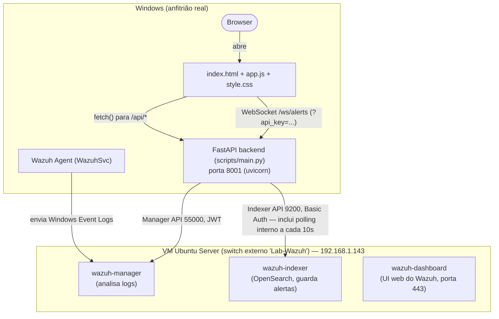

# 🔒 SentryLens

**Dashboard de Cibersegurança — Projeto CET (curso de cibersegurança)**

SentryLens é um dashboard que liga a um laboratório Wazuh real (SIEM
open-source) e mostra, em tempo quase-real, os alertas de segurança
gerados pelos Windows Security Event Logs de uma máquina monitorizada —
com nome amigável, severidade e recomendação de ação para cada tipo de
evento, em vez de IDs numéricos crus.

O projeto tem duas fases que partilham a mesma lógica de classificação:

| Fase | O que faz | Onde está |
|---|---|---|
| **Fase 1** | Analisa ficheiros de log estáticos (JSON ou CSV) e gera um relatório HTML | [`log_analyzer.py`](log_analyzer.py) — ver [`QUICKSTART.md`](QUICKSTART.md) |
| **Fase 2** *(este repo)* | Liga-se ao vivo a um laboratório Wazuh (Hyper-V) via API e mostra os alertas num dashboard web | `scripts/` (backend) + `index.html` / `app.js` / `style.css` (frontend) |

A classificação de Event ID → nome amigável / severidade / recomendação
é **exatamente a mesma lógica da Fase 1**, centralizada em
`scripts/event_catalog.py`, para que as duas fases "falem a mesma
língua".

---

## Arquitetura



> O diagrama era originalmente arte ASCII; convertido para Mermaid nesta
> sessão para acomodar o novo fluxo WebSocket (`/ws/alerts`) sem perder
> nenhum dos nós/ligações já documentados.

O backend nunca fala diretamente com o agente — ele consulta as duas
APIs do Wazuh Manager/Indexer, que já têm os alertas processados.

> ⚠️ **Nota sobre o hypervisor:** o diagrama acima e o resto deste
> README (scripts `setup-hyperv-lab.ps1`, `CLAUDE.md`) descrevem o
> caminho Hyper-V. Na prática, a VM `Wazuh-Manager` usada neste PC
> corre em **VirtualBox** (`VBoxManage list vms` confirma-o), com
> Hyper-V desativado ao nível do SO — as duas coisas não coexistem
> facilmente na mesma máquina. Os endpoints/portas/credenciais são
> iguais independentemente do hypervisor; só o arranque automático da
> VM (ver secção seguinte) usa `VBoxManage`, não `Set-VM`.

---

## 📊 Estado atual do projeto

> Última verificação: sessão de desenvolvimento de 2026-08-31.

> ⚠️ **Incidente de segurança já corrigido, mas vale a pena rodar as
> passwords do Wazuh por precaução:** durante ~20 minutos neste dia, a
> tarefa `SentryLens-Frontend` serviu `scripts/.env` (passwords reais
> do Manager/Indexer) descarregável por HTTP a qualquer dispositivo na
> rede local (`python -m http.server` serve a raiz do projeto inteira
> e liga a todas as interfaces por omissão). Corrigido com
> `scripts/serve_frontend.py` (whitelist fixa de ficheiros, só
> `127.0.0.1`). Risco real de alguém ter explorado isto numa rede
> doméstica numa janela de 20 min é baixo, mas se quiseres eliminar a
> dúvida, roda as passwords do `wazuh-wui` e do `admin` do Indexer.

- ✅ Laboratório Wazuh montado e a correr (VM `Wazuh-Manager`, IP
  `192.168.1.143` — ver nota sobre VirtualBox/Hyper-V acima).
- ✅ Backend FastAPI completo (`scripts/main.py`, `wazuh_client.py`,
  `event_catalog.py`, `system_monitor.py`) e testado de ponta a ponta
  com dados reais do Wazuh.
- ✅ **Monitorização do sistema local muito mais detalhada**
  (`system_monitor.py`): CPU (modelo, frequência, núcleos), RAM
  (módulos físicos — fabricante, part number, capacidade, velocidade,
  geração DDR, via WMI), disco (por partição: device, filesystem, **e
  o disco físico por trás — modelo e SSD/HDD**, via
  `Get-PhysicalDisk`), interfaces de rede, histórico de violações de
  threshold. Tudo Windows-only (WMI/PowerShell), com fallback vazio
  silencioso se algum comando falhar — nunca derruba o resto dos specs.
- ✅ **Frontend reorganizado em 4 abas** (`index.html` + `app.js`):
  - **Visão Geral** — KPIs, cartão de resumo do sistema (clicável, leva
    à aba Sistema) e os 3 gráficos de análise.
  - **Alertas** — banner de força bruta + tabela densa (uma linha por
    alerta, todos os campos sempre visíveis, incl. log completo).
  - **Agentes** — tabela com nome, IP, SO, estado, último keep-alive.
  - **Sistema** — lista vertical (uma linha larga por métrica: CPU,
    RAM, cada disco, rede), interfaces de rede, alertas ativos,
    histórico de violações resolvidas, gráfico de uso.
- ✅ **Identidade visual própria** — paleta extraída do logo (navy +
  ciano elétrico, tokens CSS em `style.css`) em vez de azul de SaaS
  genérico; tipografia Space Grotesk (títulos/valores) + Inter (corpo)
  + JetBrains Mono (IPs, Event IDs, timestamps, logs).
- ✅ **Arranque automático configurado** neste PC — ver
  [secção dedicada](#-arranque-automático) abaixo: VM sobe sozinha ao
  iniciar sessão, `wazuh-manager` reinicia sozinho se falhar por race
  condition no boot, backend arranca em segundo plano.
- ⚠️ **Porta 8000 ocupada** neste PC por um serviço Windows de
  terceiros (`httpd.exe` / `IBXDashboard`) — o backend usa **porta
  8001** (ver [Nota sobre a porta 8000](#nota-sobre-a-porta-8000)).
- ✅ **Agente Windows registado e `active`** — `install-wazuh-agent.ps1
  -WazuhManagerIP 192.168.1.143` corrido com sucesso; `/api/agents`
  mostra agora 2 agentes (`fnuno`/Ubuntu — o manager auto-monitorizado
  — e `DIOGO`/Windows 11). Faltou corrigir primeiro um bug de encoding
  no próprio script (ver commit "Corrige parsing quebrado em scripts
  PowerShell sem BOM UTF-8" — ficheiros `.ps1` com acentos/travessões
  sem BOM UTF-8 partem o parser do Windows PowerShell 5.1).
- ✅ **Telemetria Windows confirmada com dados reais** — logon falhado
  gerado de propósito (`Start-Process -Credential` com password errada
  contra o próprio utilizador, sem risco de bloqueio — limiar da
  política é 10 tentativas). Apareceu classificado em menos de 5s:
  `rule.id 60122`, Event ID `4625`, `friendly_name: "Failed Logon"`,
  `severity: high` — confirma a Parte 6 do
  [guia](docs/LAB_WAZUH_HYPERV.md#parte-6--valida%C3%A7%C3%A3o-final)
  ponta-a-ponta (Windows → agente → manager → indexer → backend →
  frontend).
- ✅ **`log_analyzer.py` (Fase 1) recuperado** — estava só no repositório
  antigo `dashboard-seguranca` (nome de trabalho deste projeto antes do
  rebranding, entretanto apagado); trazido de volta com
  `sample_events.json` (dados de exemplo), `QUICKSTART.md`, e o par
  `report.html`/`report.json` gerado por ele.
- ✅ **Autenticação por API key** nos endpoints `/api/*` (header
  `X-API-Key`, variável `SENTRYLENS_API_KEY`) — fecha o achado "zero
  autenticação" da auditoria de 2026-08-31 acima. Ver [secção
  dedicada](#-autenticação-por-api-key) na documentação da API.
- ✅ **Atualização em tempo real via WebSocket** (`WS /ws/alerts`) —
  substitui o polling fixo de 30s do frontend por push imediato quando
  há alertas novos; o polling de 30s passa a ser só o fallback se a
  ligação WebSocket falhar. Ver [secção dedicada](#-websocket-em-tempo-real-wsalerts).
- ✅ **Persistência própria de histórico de alertas**
  (`scripts/history_store.py`) — cada alerta novo detetado pelo polling
  interno do WebSocket (`alert_poll_loop`, a cada 10s) passa também a
  ficar gravado em disco, em ficheiros JSONL organizados por ano/mês, para
  sobreviver aos 90 dias de retenção do Wazuh Indexer. Ver [secção
  dedicada](#-histórico-próprio-de-alertas-scriptshistorico), logo a
  seguir ao WebSocket na documentação da API.
- ✅ **Exportação de relatório HTML** (`scripts/report_generator.py`) —
  novo endpoint `GET /api/export/report` gera um ficheiro HTML autónomo
  (CSS embutido, paleta do dashboard, sem pedidos a recursos externos)
  com o estado atual do dashboard, pronto para guardar offline, enviar
  por email ou anexar a um relatório do CET. Ver [secção
  dedicada](#-exportar-relatório-html-getapiexportreport), logo a seguir
  ao histórico próprio de alertas na documentação da API.
- ❌ Ainda sem distinção entre múltiplos utilizadores (a key é partilhada,
  não é login), e sem camada de índice/consulta rápida sobre o histórico
  (ex: SQLite para perguntas tipo "todos os alertas RGPD entre março e
  maio") — ver [Próximos passos](#-próximos-passos).
- ✅ **Camada de conformidade regulatória (RGPD/NIS2/AI Act)** — cada
  alerta passa a ser avaliado contra as 3 normas, com veredito explícito
  ("aplicável" ou "verificado e não aplicável", nunca omitido em
  silêncio) e registo de auditoria persistido. Ver [secção
  dedicada](#-conformidade-regulatória-rgpd-nis2-ai-act) na
  documentação da API.

---

## 📁 Estrutura do repositório

```
Dashboard cybersec/
├── README.md                    ← este ficheiro
├── CLAUDE.md                    ← instruções do projeto para o Claude Code
├── index.html                   ← frontend: página do dashboard
├── app.js                       ← frontend: lógica (fetch às APIs, render)
├── style.css                    ← frontend: estilos
├── logo.png
│
├── log_analyzer.py              ← Fase 1: analisa logs estáticos (JSON/CSV), gera relatório HTML
├── sample_events.json           ← dados de exemplo para testar o log_analyzer.py
├── report.html / report.json    ← exemplo de output gerado pelo log_analyzer.py
├── QUICKSTART.md                ← guia rápido do log_analyzer.py (Fase 1)
├── HARDENING_CHECKLIST.md       ← checklist de hardening Windows, referência autónoma
├── INCIDENT_RESPONSE.md         ← playbook de resposta a incidentes, referência autónoma
│
├── scripts/                     ← backend FastAPI + automação do laboratório
│   ├── main.py                  ← app FastAPI, endpoints REST
│   ├── wazuh_client.py          ← cliente para Manager API + Indexer API
│   ├── event_catalog.py         ← classificação de Event IDs (Fase 1 reaproveitada)
│   ├── requirements.txt         ← dependências Python do backend
│   ├── .env                     ← credenciais reais (não versionar!)
│   ├── .env.example             ← template de configuração
│   ├── README.md                ← guia dos scripts de automação do laboratório
│   ├── system_monitor.py        ← specs/saúde da máquina local (CPU/RAM/disco/rede)
│   ├── setup-hyperv-lab.ps1     ← 1) cria Hyper-V switch + VM (Windows, Admin)
│   ├── install-wazuh.sh         ← 2) instala o Wazuh dentro da VM (via SSH)
│   ├── install-wazuh-agent.ps1  ← 3) instala o agente no Windows (Admin)
│   ├── start-backend.ps1        ← wrapper usado pela tarefa agendada SentryLens-Backend
│   └── start-frontend.ps1       ← wrapper usado pela tarefa agendada SentryLens-Frontend
│
└── docs/
    ├── README.md                ← guia detalhado de setup do backend/frontend
    └── LAB_WAZUH_HYPERV.md      ← guia passo-a-passo completo do laboratório
                                    (cobre VirtualBox *e* Hyper-V — este
                                    projeto usa o caminho Hyper-V)
```

---

## ✅ Pré-requisitos

- Windows 10/11 Pro, Enterprise ou Education (Hyper-V não existe na
  edição Home).
- Virtualização de hardware (Intel VT-x / AMD-V) ativa na BIOS/UEFI.
- Python 3.12+ instalado e no PATH.
- Uma VM Ubuntu Server 22.04 LTS com Wazuh instalado, acessível na
  rede local (ver secção seguinte).

---

## 1. Montar o laboratório Wazuh

Guia completo: [`docs/LAB_WAZUH_HYPERV.md`](docs/LAB_WAZUH_HYPERV.md).
Resumo dos 3 scripts automatizados, **corridos manualmente por esta
ordem** (nunca em automático — envolvem reiniciar o PC e mexer em
virtualização):

| # | Script | Onde corre | O que automatiza |
|---|---|---|---|
| 1 | `scripts/setup-hyperv-lab.ps1` | Windows anfitrião (PowerShell, Admin) | Ativa Hyper-V, cria o Virtual Switch `Lab-Wazuh` (externo) e a VM (Geração 2, 8 GB RAM, 4 vCPU, 60 GB disco dinâmico, Secure Boot desativado) |
| — | *(manual)* instalação do Ubuntu Server | Consola Hyper-V | Interativo de propósito — idioma, disco, utilizador, e sobretudo marcar **"Install OpenSSH server"** |
| 2 | `scripts/install-wazuh.sh` | Dentro da VM Ubuntu (via SSH) | `apt update/upgrade`, `wazuh-install.sh -a`, mostra as passwords geradas, confirma manager/indexer/dashboard `active (running)` |
| — | *(manual)* login no Dashboard Wazuh | Browser do Windows | `https://<IP_DA_VM>` → aceitar certificado autoassinado → login `admin` |
| 3 | `scripts/install-wazuh-agent.ps1 -WazuhManagerIP <IP_DA_VM>` | Windows a monitorizar (PowerShell, Admin) | Descarrega o MSI do agente, instala silenciosamente, arranca `WazuhSvc`, confirma `Running` |
| — | *(manual)* validação final | Wazuh Dashboard | Management → Endpoints → agente `Active`; gerar logon falhado de propósito e confirmar `rule.id 60122` / Event ID `4625` em Threat Hunting |

Detalhes de cada parâmetro (`Get-Help .\setup-hyperv-lab.ps1 -Full`) e
a lista de passos propositadamente **não** automatizados (BIOS/UEFI,
instalador interativo, etc.) estão em
[`scripts/README.md`](scripts/README.md).

---

## 2. Configurar e correr o backend

```bash
cd scripts
pip install -r requirements.txt
cp .env.example .env    # depois editar com os valores reais
```

Editar `scripts/.env`:

```env
# Wazuh Manager API (porta 55000)
WAZUH_MANAGER_URL=https://<IP_DA_VM>:55000
WAZUH_MANAGER_USER=wazuh-wui
WAZUH_MANAGER_PASSWORD=<password real>

# Wazuh Indexer API (porta 9200)
WAZUH_INDEXER_URL=https://<IP_DA_VM>:9200
WAZUH_INDEXER_USER=admin
WAZUH_INDEXER_PASSWORD=<password real>
```

Ambas as passwords vêm do ficheiro gerado durante a instalação do
Wazuh (dentro da VM):

```bash
sudo tar -O -xvf wazuh-install-files.tar wazuh-install-files/wazuh-passwords.txt
```

Correr o backend:

```bash
uvicorn main:app --reload --port 8001
```

Confirmar que está de pé (já precisa da API key — ver
[Autenticação por API key](#-autenticação-por-api-key) acima):

```bash
curl -H "X-API-Key: <a tua SENTRYLENS_API_KEY>" http://localhost:8001/api/health
# {"status":"ok","timestamp":"2026-08-28T21:47:37.019106"}
```

Sem o header, este pedido devolve `401`.

> Não há documentação interativa (Swagger/`/docs`) — foi desligada de
> propósito (`docs_url=None` em `main.py`), porque `dependencies=[Depends(...)]`
> não protege essas rotas automáticas do FastAPI (só as registadas via
> `@app.get`/`@app.post`), e mantê-las abertas exporia toda a topologia
> da API sem autenticação.

### Nota sobre a porta 8000

O default "óbvio" para uma app FastAPI seria a porta 8000, mas **neste
PC essa porta já está ocupada** por um serviço Windows de terceiros:

```
> tasklist | findstr 8000-relacionado
httpd.exe   4940   Services

> tasklist /svc /fi "PID eq 4940"
httpd.exe   4940   IBXDashboard
```

É um Apache (`httpd.exe`) a correr como serviço persistente chamado
`IBXDashboard`, sem relação nenhuma com este projeto. Por isso o
backend e a documentação usam **8001** como porta default — não é
preciso mexer no serviço `IBXDashboard` nem investigar mais, só usar
8001 sempre que correres `uvicorn` aqui.

---

## 🚀 Arranque automático

Configurado neste PC para que, ao iniciar sessão, tudo suba sozinho —
quatro peças independentes:

| # | O quê | Onde | Como |
|---|---|---|---|
| 1 | VM `Wazuh-Manager` arranca em headless | Windows Task Scheduler | Tarefa `Wazuh-Manager-VM`, trigger "ao iniciar sessão", corre `VBoxManage startvm "Wazuh-Manager" --type headless` |
| 2 | `wazuh-manager` resiste a falhar no boot | VM (systemd override) | `/etc/systemd/system/wazuh-manager.service.d/override.conf` — `Restart=on-failure`, `RestartSec=15` (o `wazuh-apid` por vezes morre por race condition com o Indexer a arrancar ao mesmo tempo) |
| 3 | Backend FastAPI arranca em segundo plano | Windows Task Scheduler | Tarefa `SentryLens-Backend`, trigger "ao iniciar sessão", corre `scripts/start-backend.ps1` (uvicorn escondido, logs em `scripts/backend.log`) |
| 4 | Frontend arranca e abre no browser | Windows Task Scheduler | Tarefa `SentryLens-Frontend`, trigger "ao iniciar sessão" com atraso de 10s (depois do backend), corre `scripts/start-frontend.ps1` (`python -m http.server 5500` escondido + abre `http://localhost:5500/index.html`, logs em `scripts/frontend.log`) |

Gerir as tarefas: `Get-ScheduledTask -TaskName "SentryLens-Backend","SentryLens-Frontend","Wazuh-Manager-VM"`
no PowerShell, ou pela app "Agendador de Tarefas" do Windows.
`Unregister-ScheduledTask -TaskName <nome>` remove uma.

A tarefa 4 existe porque abrir `index.html` por duplo-clique (`file://`)
deixou de funcionar depois da correção de CORS de 2026-08-31 — ver
[Servir o frontend](#3-servir-o-frontend).

É normal, nos primeiros 1–3 minutos depois do login, `/api/agents`,
`/api/alerts`, etc. devolverem `502` enquanto a VM e os serviços Wazuh
ainda estão a arrancar — o backend não falha, só não consegue
contactar o Wazuh ainda.

---

## 3. Servir o frontend

O frontend é HTML/CSS/JS puro (`index.html`, `app.js`, `style.css`, na
raiz do repo, ao lado uns dos outros). `app.js` aponta para
`API_BASE = "http://localhost:8001"`.

**Opção A — automático (já configurado neste PC):** a tarefa agendada
`SentryLens-Frontend` serve o frontend em `localhost:5500` e abre o
browser sozinha ao iniciares sessão — ver [Arranque automático](#-arranque-automático).
Não precisas de fazer nada.

**Opção B — servidor estático manual:**

```bash
python -m http.server 5500
```

Depois abrir `http://localhost:5500/index.html`.

**Opção C — abrir diretamente (não recomendado):**

Duplo-clique em `index.html`. **Deixou de funcionar** desde que o CORS
do backend ficou restrito a `localhost`/`127.0.0.1` (correção de
segurança de 2026-08-31) — `file://` envia `Origin: null`, que essa
restrição não reconhece de propósito. Usa a Opção A ou B.

O dashboard liga-se por WebSocket (`/ws/alerts`) ao carregar a página e
atualiza-se **imediatamente** quando chega um alerta novo, em vez de
esperar por um ciclo de polling — ver [secção
dedicada](#-websocket-em-tempo-real-wsalerts). O polling fixo a cada 30
segundos continua a existir só como *fallback* caso o WebSocket falhe,
e o botão "🔄 Atualizar" continua disponível para forçar uma atualização
manual a qualquer momento. O indicador no canto superior direito
mostra:

- **● ligado ao Wazuh** (verde) — todos os pedidos à API tiveram
  sucesso.
- **● sem ligação** (vermelho) — pelo menos um pedido falhou (backend
  em baixo, ou backend incapaz de contactar o Wazuh — ver consola do
  browser, F12, para o erro exato).

A interface está organizada em 4 abas:

| Aba | Conteúdo |
|---|---|
| 📊 **Visão Geral** | KPIs (total/severidade/agentes ativos), cartão de resumo do sistema (clicável → aba Sistema), gráficos de análise |
| 🚨 **Alertas** | Banner de força bruta (quando há suspeitos) + tabela densa com todos os campos de cada alerta, incl. log completo |
| 🖥️ **Agentes** | Tabela de agentes Wazuh — nome, IP, SO, estado, último keep-alive |
| ⚙️ **Sistema** | CPU/RAM/disco/rede desta máquina em detalhe (modelo, módulos, SSD/HDD), interfaces de rede, alertas de sistema ativos, histórico de violações, gráfico de uso |

---

## 4. Endpoints da API

Todos devolvem JSON, com uma exceção: `GET /api/export/report` devolve
o relatório em HTML como ficheiro para download (ver [secção
dedicada](#-exportar-relatório-html-getapiexportreport)). CORS
restringido a origens loopback (`localhost`/`127.0.0.1`, qualquer
porta) — nenhuma origem externa consegue ler as respostas. Todos os
endpoints `/api/*` (incluindo `/api/health`) exigem também uma API key
partilhada no header `X-API-Key` — ver a secção seguinte para como
gerar e configurar.

### 🔑 Autenticação por API key

> ✅ **Adicionado em 2026-09-13** — fecha o achado da
> [auditoria de segurança de 2026-08-31](#-estado-atual-do-projeto)
> que sinalizava zero autenticação nos endpoints. A partir de agora,
> **todos** os endpoints `/api/*`, incluindo `/api/health`, exigem
> esta key.

Mecanismo propositadamente simples — uma única key partilhada, sem
sessões, sem múltiplos utilizadores, sem JWT — adequado ao que este
dashboard é (ferramenta de laboratório local, não uma aplicação
exposta à internet).

**1. Gerar uma key forte:**

```bash
# Linux/macOS/Git Bash
openssl rand -hex 32
```

```powershell
# PowerShell (Windows-first, sem depender de OpenSSL instalado)
-join ((1..32) | ForEach-Object { "{0:x2}" -f (Get-Random -Maximum 256) })
```

**2. Configurar no backend** — acrescentar a `scripts/.env` (variável
também documentada em `scripts/.env.example`):

```env
SENTRYLENS_API_KEY=<a key gerada acima>
```

**3. Configurar no frontend** — editar a constante `API_KEY` perto do
topo de `app.js` (ao lado de `API_BASE`) com o **mesmo valor**:

```js
const API_KEY = "<a mesma key de scripts/.env>";
```

Todos os pedidos do frontend passam a enviar o header `X-API-Key` com
este valor.

**Comportamento fail-closed:** sem `SENTRYLENS_API_KEY` definida no
backend, ou com o header `X-API-Key` em falta ou errado no pedido, a
API devolve sempre `401`:

```json
{"detail": "API key inválida ou em falta"}
```

Nunca fica "aberta" por omissão — se a variável de ambiente não
estiver definida no backend, a API bloqueia tudo em vez de aceitar
pedidos sem chave.

> ⚠️ **Limitação honesta:** como o frontend é JavaScript estático
> entregue tal-e-qual ao browser (sem build step), a key fica visível
> no código-fonte (`view-source:`, DevTools) para quem aceder à
> página. Isto é aceitável **só** porque o CORS já restringe os
> pedidos a `localhost`/`127.0.0.1` e este é um dashboard de
> laboratório de um único utilizador nesta máquina — **não é um
> modelo de segurança válido** para uma aplicação exposta à internet
> ou com múltiplos utilizadores. Não há rotação de keys nem suporte a
> múltiplas keys nesta fase.

O CORS mantém-se exatamente como antes (`allow_origin_regex`
restrito a origens loopback) — a API key é uma camada adicional, não
uma substituição.

### 🔌 WebSocket em tempo real (`/ws/alerts`)

> ✅ **Adicionado em 2026-09-13** — fecha o item "Websockets" da lista
> de [Próximos passos](#-próximos-passos): o dashboard deixa de
> depender só do polling de 30s para saber que há alertas novos.

**`WS /ws/alerts`** — o backend mantém, desde sempre nesta versão, um
ciclo interno (`alert_poll_loop`, em `scripts/websocket_alerts.py`,
arrancado no evento `startup` do FastAPI ao lado do já existente loop
de monitorização de sistema) que consulta o Wazuh Indexer **a cada
10s** à procura de alertas novos — isto acontece sempre, com ou sem
clientes WebSocket ligados. Quando um cliente está ligado a
`/ws/alerts`, cada alerta novo detetado é reenviado (*pushed*) para
ele assim que aparece, em vez de o frontend ter de o ir buscar por
`fetch()`. Cada alerta é identificado de forma única pelo `_id` do
documento no OpenSearch (campo já incluído em cada alerta devolvido por
`WazuhIndexerClient.get_recent_alerts(...)` em `scripts/wazuh_client.py`)
— é esse `_id` que o backend usa para saber quais alertas já foram
enviados a um cliente e não os reenviar.

> Não confundir os dois "10s"/"30s": o polling **interno** do backend
> ao Wazuh Indexer é a cada **10s** (existe sempre, independente do
> frontend); o polling do **frontend** ao backend é a cada **30s** e
> só corre como *fallback*, quando o WebSocket não está disponível.

**Autenticação — diferente da REST, e de propósito:** os endpoints
`/api/*` exigem o header `X-API-Key` (ver secção acima), mas o
handshake de WebSocket feito pelo browser não permite enviar headers
HTTP arbitrários — por isso `/ws/alerts` autentica-se por **query
param**, com a mesma `SENTRYLENS_API_KEY`:

```
ws://localhost:8001/ws/alerts?api_key=<a mesma SENTRYLENS_API_KEY>
```

Sem o parâmetro `api_key`, ou com um valor errado, o servidor **fecha
a ligação com o código `1008`** antes de a aceitar (nunca chega a
entregar nenhum alerta).

**Formato das mensagens** enviadas pelo servidor a cada alerta novo:

```json
{
  "type": "new_alert",
  "alert": {
    "timestamp": "2026-09-13T10:15:00Z",
    "agent_name": "DESKTOP-ABC",
    "rule_id": "60122",
    "windows_event_id": 4625,
    "friendly_name": "Failed Logon",
    "severity": "high"
  }
}
```
O objeto em `alert` tem exatamente a mesma forma de um item da lista
`alerts` de `GET /api/alerts`.

**Comportamento do frontend (`app.js`):** `connectWebSocket()` liga-se
por WebSocket ao carregar a página. Ao receber uma mensagem
`new_alert`, chama `refreshDashboard()`, que volta a pedir tudo por
REST e a re-renderizar, respeitando os filtros já selecionados (a
mensagem WebSocket é só o "toque a rebate" — os dados em si continuam
a vir da API REST). Se a ligação falhar ou cair, o frontend tenta
reconectar com *backoff* exponencial: **1s, 2s, 4s, 8s, 16s** (5
tentativas). Se todas falharem, mostra um aviso visível no topo do
dashboard —

> ⚠️ Ligação em tempo real indisponível — a atualizar a cada 30s

— e passa a depender só do polling fixo de 30s como *fallback*
definitivo. **Decisão consciente de simplicidade:** nesta versão não
há nenhum retry automático depois de esgotadas as 5 tentativas (evita
um loop de reconexão a correr para sempre em segundo plano) — o aviso
só desaparece se a página for recarregada e a ligação WebSocket voltar
a funcionar.

**Testes:** `scripts/test_websocket_alerts.py` (mesmo padrão standalone
dos outros scripts de teste do backend — sem framework, imprime
`[OK]`/`[FALHOU]` por caso), cobrindo ligação recusada sem `api_key`,
ligação recusada com `api_key` errada, ligação aceite com a key
correta, e deteção de alertas novos vs. já vistos (por `_id`).

### 🗄️ Histórico próprio de alertas (`scripts/historico/`)

> ✅ **Adicionado em 2026-09-14** — fecha o item "Persistência própria" da
> lista de [Próximos passos](#-próximos-passos): os alertas passam a
> sobreviver para além dos 90 dias que o Wazuh Indexer guarda por
> política de retenção (para não encher o disco da VM do laboratório).

**Motivação:** o Wazuh Indexer (OpenSearch) apaga alertas com mais de 90
dias. O SentryLens passa a guardar o seu próprio histórico de longo
prazo, em paralelo, para não depender dessa janela.

**Mecanismo — reaproveita a deteção de alertas novos, não cria um
segundo poller:** o mesmo `alert_poll_loop` do WebSocket (Fase 8,
`scripts/websocket_alerts.py`, que já corre a cada 10s a consultar o
Wazuh Indexer — ver [WebSocket em tempo
real](#-websocket-em-tempo-real-wsalerts) acima) chama agora, para cada
alerta novo que deteta, também `append_alerts_history()` do novo módulo
`scripts/history_store.py`. Não há um segundo ciclo de polling
independente só para o histórico — é o mesmo evento "alerta novo
detetado" a alimentar duas coisas (o push por WebSocket e a escrita em
disco).

**Estrutura de pastas** — ano com 4 dígitos, mês com número + nome por
extenso em português (com acento), sem pasta de dia (o dia entra no
nome do ficheiro, sempre com a data completa `AAAA-MM-DD` à frente):

```
scripts/historico/
  2026/
    09-setembro/
      2026-09-13-alerts.jsonl
```

**Formato de cada linha** — JSONL *append-only* (nunca sobrescreve, só
acrescenta), um alerta por linha, com `date` sempre como primeira chave
do objeto (para o ficheiro ordenar bem cronologicamente mesmo aberto num
editor de texto ou exportado para outra ferramenta):

```json
{"date": "2026-09-13", "time": "14:32:07", "event_id": 4625, "severity": "high", "friendly_name": "Failed Logon", "agent_name": "WIN-PC01", "rule_id": "60122"}
```

**Configuração** — localização configurável via `SENTRYLENS_HISTORY_DIR`
(default: `scripts/historico`, documentada em `scripts/.env.example`).
`scripts/historico/` está no `.gitignore` — é dado gerado em runtime, não
código-fonte, o mesmo padrão de `scripts/system_alerts_history.json`,
`scripts/snapshots/` e `scripts/models/`.

> ⚠️ **Não confundir com os snapshots de treino de ML da Fase 6**
> (`scripts/export_snapshot.py`, já existente e separado — ver [secção
> 6](#6-deteção-de-anomalias-por-machine-learning)). Aquele gera um
> formato completo de features para retreino do modelo de anomalias;
> este histórico é um registo simplificado por alerta (os 7 campos
> acima), pensado para retenção/consulta de longo prazo, não para
> treino.

**Fora de escopo nesta fase:** não há camada de índice (ex: SQLite) para
consultas rápidas tipo "todos os alertas RGPD entre março e maio" — os
ficheiros JSONL têm de ser lidos/filtrados manualmente por agora — nem
um endpoint REST novo para consultar este histórico. Fica como trabalho
futuro (ver [Próximos passos](#-próximos-passos)).

### 📄 Exportar relatório HTML (`GET /api/export/report`)

> ✅ **Adicionado em 2026-09-14** — fecha o item "Exportar relatório" da
> lista de [Próximos passos](#-próximos-passos): já é possível gerar um
> ficheiro HTML autónomo com o estado atual do dashboard, no mesmo
> espírito do relatório da Fase 1 (`log_analyzer.py`).

**Motivação:** guardar, enviar por email ou anexar a um relatório do CET
o estado atual do dashboard (KPIs, alertas, agentes, sistema) num único
ficheiro HTML autónomo — CSS embutido, sem pedidos a recursos externos —
que abre offline em qualquer lado, sem depender do backend estar a
correr para o reabrir depois.

**Endpoint:** `GET /api/export/report?hours=24` — mesmo parâmetro
`hours` (1–168) dos outros endpoints, protegido pela mesma autenticação
`X-API-Key` de todos os endpoints REST (ver [Autenticação por API
key](#-autenticação-por-api-key)). Devolve o HTML diretamente como
ficheiro (`Content-Disposition: attachment`), com nome
`AAAA-MM-DD-relatorio.html` (data do dia em que foi gerado).

**Gerador (`scripts/report_generator.py`):** função pura
`generate_html_report(...)` que não fala com o Wazuh diretamente —
recebe os dados já obtidos pelas funções internas dos endpoints já
existentes (`get_stats`, `get_alerts`, `get_agents`, `get_system_specs`).
Cada uma destas 4 fontes pode falhar independentemente sem derrubar o
relatório inteiro: o endpoint continua a devolver `200`, e só a secção
correspondente do HTML aparece marcada como "indisponível" — o relatório
nunca falha por completo só porque uma parte dos dados não está
acessível.

**Segurança — escaping do texto dinâmico:** todo o texto que vem dos
alertas/agentes (nomes de agentes, descrições de regra, `full_log`) é
escapado com `html.escape()` antes de entrar no HTML — a mesma
disciplina já aplicada em `app.js` contra XSS armazenado (auditoria de
2026-08-31). É especialmente necessário aqui porque, ao contrário do
dashboard ao vivo, este ficheiro é gravado em disco e reaberto
diretamente no browser, sem passar por nenhuma sanitização adicional.

**Identidade visual:** reaproveita a paleta navy+ciano já usada no
dashboard (`--navy-950`, `--navy-800`, `--cyan-600`, `--cyan-700`,
`--ink-900` — os mesmos tokens de `style.css`), para que o relatório
exportado pareça uma extensão do dashboard, não um documento à parte.

**Botão no frontend:** "📄 Exportar relatório" no header de controlos
partilhado (`index.html`/`app.js`, junto ao botão "🔄 Atualizar") —
visível em todas as abas, não só na Visão Geral, tal como o próprio
seletor de janela temporal que já vive nesse header. Respeita o período
(`hours`) já selecionado no seletor. Como o download exige o header
`X-API-Key` (que um `<a href>` simples não consegue enviar), é feito via
`fetch()` + `Blob` + link temporário criado em memória.

**Integração com a conformidade regulatória (Fase 7):** `generate_html_report`
recebe um parâmetro `compliance_html` — quando os alertas da janela
selecionada conseguem ser avaliados, `main.py` preenche-o com
`report_generator.render_compliance_section(...)`, e o relatório exportado
passa a incluir a secção de conformidade (RGPD/NIS2/AI Act) com os 3
vereditos por alerta; se a avaliação falhar, `compliance_html` fica vazio
e essa secção simplesmente não aparece, sem derrubar o resto do relatório.
Ver [secção dedicada](#-conformidade-regulatória-rgpd-nis2-ai-act) logo a
seguir à documentação deste endpoint.

### 🛡️ Conformidade regulatória (RGPD, NIS2, AI Act)

> ✅ **Adicionado em 2026-09-14 (Fase 7)** — cada alerta passa a ser
> avaliado contra 3 normas regulatórias, mostrando **sempre** um
> veredito por norma ("aplicável" ou "verificado e não aplicável") —
> nunca omitindo a verificação em silêncio, mesmo quando o resultado é
> "não aplicável".

**Motivação:** um dashboard de segurança que gera alertas sobre
identidade, grupos e privilégios toca inevitavelmente em obrigações
regulatórias (proteção de dados pessoais, notificação de incidentes,
sistemas de IA). Em vez de deixar essa análise implícita, o SentryLens
regista explicitamente, por alerta, se cada norma se aplica ou não — e
porquê.

**Arquitetura em 5 camadas:**

1. **Catálogo de regras** — [`scripts/compliance_rules.yaml`](scripts/compliance_rules.yaml)
   (YAML, não Python, porque as regras/textos de justificação mudam com
   mais frequência do que a lógica que as aplica): condições de
   aplicabilidade por norma + texto de justificação para cada veredito
   possível.
2. **Motor de avaliação** — [`scripts/compliance_evaluator.py`](scripts/compliance_evaluator.py),
   função pura `evaluate_alert_compliance(alert, org_profile, rules)`
   (mesmo padrão de `lifecycle.py`/`rbac.py`/`admin_activity.py`: recebe
   tudo já pronto, nunca fala com o Wazuh):
   - **RGPD** — depende da **categoria** do alerta: autenticação, gestão
     de grupos, ciclo de vida de contas e atividade privilegiada
     envolvem dados pessoais (identificadores de utilizador, IPs de
     origem) → aplicável; as restantes categorias → verificado e não
     aplicável.
   - **NIS2** — depende do **estatuto da entidade** (perfil) **e** da
     **severidade** do alerta: só é "aplicável" se a organização estiver
     sujeita à NIS2 *e* o alerta atingir o limiar de incidente
     significativo (`severity` `critical`/`high`); caso contrário fica
     "verificado e não aplicável", com justificação diferente consoante
     falhe o estatuto ou a severidade.
   - **AI Act** — depende só do **perfil**: se a organização opera um
     componente de IA ativo (aqui, a deteção de anomalias por Isolation
     Forest da Fase 6, `GET /api/ml-anomalies`) → aplicável; caso
     contrário → verificado e não aplicável.
3. **Perfil da organização** — [`scripts/org_profile.py`](scripts/org_profile.py),
   função `get_org_profile()`. Fixo por agora — o CET não é uma empresa
   real — com `estatuto_nis2_aplicavel=False`,
   `processa_dados_pessoais=True`, `tem_componentes_ia_ativos=True`.
   Lido **sempre** através da função, nunca do dict diretamente, para
   poder ser substituído no futuro (ex: por uma pesquisa real de
   enquadramento NIS2 a partir do NIPC/CAE de uma empresa) sem tocar no
   motor de avaliação.
4. **Relatório** — nova secção de conformidade no relatório HTML
   exportável (`GET /api/export/report`, [secção 📄 acima](#-exportar-relatório-html-getapiexportreport)),
   via `report_generator.render_compliance_section(...)`: mostra os 3
   vereditos por alerta, mais um resumo agregado no topo. Módulo puro
   (não importa `compliance_evaluator` — recebe os pares
   alerta/veredito já calculados), com o mesmo escaping HTML do resto do
   relatório.
5. **Registo de auditoria** — `history_store.append_compliance_history(...)`
   persiste o veredito de cada alerta novo em
   `scripts/historico/AAAA/MM-mês/AAAA-MM-DD-compliance.jsonl` (mesma
   pasta/dia do `alerts.jsonl` já existente da [Fase 9](#-histórico-próprio-de-alertas-scriptshistorico)),
   reaproveitando a deteção de alertas novos já existente do
   `alert_poll_loop` do WebSocket (Fase 8) — **sem criar um poller
   novo**. O registo acontece mesmo quando o veredito é "não aplicável"
   em todas as normas, porque a auditoria também é o registo de que a
   verificação foi feita, não só dos casos "aplicável".

**Endpoint:** `GET /api/compliance?hours=24` (protegido pela mesma
`X-API-Key` de todos os outros endpoints REST). Avalia os alertas
recentes do Wazuh Indexer contra as 3 normas e devolve o perfil da
organização usado, um resumo agregado por norma, e o veredito completo
por alerta:

```json
{
  "window_hours": 24,
  "total": 42,
  "org_profile": {
    "nome": "SentryLens (laboratório CET)",
    "estatuto_nis2_aplicavel": false,
    "processa_dados_pessoais": true,
    "tem_componentes_ia_ativos": true
  },
  "summary": {
    "rgpd": {"aplicavel": 30, "verificado_e_nao_aplicavel": 12},
    "nis2": {"aplicavel": 5, "verificado_e_nao_aplicavel": 37},
    "ai_act": {"aplicavel": 42, "verificado_e_nao_aplicavel": 0}
  },
  "alerts": [
    {
      "timestamp": "2026-09-14T10:15:00Z",
      "friendly_name": "Failed Logon",
      "severity": "high",
      "compliance": {
        "rgpd": {"estado": "aplicavel", "justificacao": "..."},
        "nis2": {"estado": "verificado_e_nao_aplicavel", "justificacao": "..."},
        "ai_act": {"estado": "aplicavel", "justificacao": "..."}
      }
    }
  ]
}
```
Cada item de `alerts` tem exatamente os mesmos campos de um item de
`GET /api/alerts`, mais o campo `compliance` acrescentado. Erro →
`502` `{"detail": "Erro ao contactar Wazuh Indexer: ..."}`, mesmo padrão
dos outros endpoints que dependem do Indexer.

> ⚠️ **Trabalho futuro, não implementado nesta fase:** o `org_profile.py`
> atual é fixo (hardcoded) — não há pesquisa automática de enquadramento
> NIS2 para uma empresa real a partir do seu NIPC/CAE. Está previsto (mas
> **fora de escopo** desta fase) um módulo `nis2_lookup.py`, assíncrono,
> que devolveria uma classificação sugerida com grau de confiança e
> fontes — nunca um veredito jurídico definitivo, sempre "a confirmar
> junto do CNCS". Esta fase entrega uma base funcional de conformidade
> com um perfil fixo, não uma pesquisa automática por empresa real.

### `GET /api/health`
Confirma que o backend está de pé (não testa ligação ao Wazuh).
```json
{"status": "ok", "timestamp": "2026-08-28T21:47:37.019106"}
```

### `GET /api/agents`
Lista de agentes Wazuh e o seu estado atual (via Manager API).
```json
{
  "agents": [
    {"id": "001", "name": "DESKTOP-ABC", "ip": "192.168.1.50",
     "status": "active", "os": "Windows 11", "last_keep_alive": "..."}
  ],
  "summary": { "connection": {"active": 1, "disconnected": 0, "never_connected": 0} }
}
```
Erro → `502` `{"detail": "Erro ao contactar Wazuh Manager: ..."}`.

### `GET /api/alerts`
Alertas recentes, já enriquecidos com a classificação de Event ID.

| Parâmetro | Tipo | Default | Descrição |
|---|---|---|---|
| `hours` | int (1–168) | 24 | Janela temporal |
| `min_level` | int (0–16) | 0 | Nível mínimo de severidade *Wazuh* (`rule.level`) |
| `agent_name` | string | — | Filtra por nome de agente |
| `severity` | string | — | Filtra pela severidade *classificada* (`critical`/`high`/`medium`/`low`) |

```json
{
  "total": 3,
  "alerts": [
    {
      "timestamp": "2026-08-28T21:40:00Z",
      "agent_name": "DESKTOP-ABC",
      "agent_ip": "192.168.1.50",
      "rule_id": "60122",
      "rule_description": "Failed logon attempt",
      "wazuh_level": 10,
      "windows_event_id": 4625,
      "friendly_name": "Failed Logon",
      "severity": "high",
      "recommendation": "Implementar bloqueio de conta após N falhas. Investigar origem dos IPs. Considerar MFA.",
      "full_log": "..."
    }
  ]
}
```
Erro → `502` `{"detail": "Erro ao contactar Wazuh Indexer: ..."}`.

### `GET /api/stats`
KPIs agregados para os cartões do dashboard.

| Parâmetro | Tipo | Default |
|---|---|---|
| `hours` | int (1–168) | 24 |

```json
{
  "window_hours": 24,
  "total_alerts": 42,
  "by_severity": {"high": 10, "medium": 20, "info": 12},
  "top_events": [{"event_id": 4625, "name": "Failed Logon", "count": 8}],
  "by_agent": {"DESKTOP-ABC": 42}
}
```

### `GET /api/brute-force`
Deteção de força bruta: agrupa Event ID `4625` (Failed Logon) por
utilizador-alvo e assinala quem excedeu o `threshold`.

| Parâmetro | Tipo | Default |
|---|---|---|
| `hours` | int (1–168) | 24 |
| `threshold` | int (≥1) | 5 |

```json
{
  "window_hours": 24,
  "threshold": 5,
  "suspects": [
    {"user": "administrador", "failed_attempts": 7,
     "last_attempt": "2026-08-28T21:39:00Z", "source_agent": "DESKTOP-ABC"}
  ]
}
```

### `GET /api/ml-anomalies`
Deteção de anomalias por Machine Learning (Isolation Forest), **lado a
lado** com a classificação por regras do `event_catalog.py` — ver
detalhe completo na secção [6. Deteção de anomalias por Machine
Learning](#6-deteção-de-anomalias-por-machine-learning) logo a seguir
ao catálogo de Event IDs.

| Parâmetro | Tipo | Default | Descrição |
|---|---|---|---|
| `hours` | int (1–168) | 24 | Janela temporal (máximo 7 dias) |

```json
{
  "total": 36,
  "ml_anomalies_count": 7,
  "rule_flagged_count": 8,
  "agree_count": 27,
  "diverge_count": 9,
  "window_hours": 24,
  "results": [
    {
      "timestamp": "2026-09-10T14:22:00+00:00",
      "agent_name": "WIN-PC01",
      "target_user": "administrator",
      "windows_event_id": 4625,
      "severity": "high",
      "rule_flagged": true,
      "ml_score": -0.0842,
      "ml_is_anomaly": true,
      "agreement": "agree"
    }
  ]
}
```
Erro → `503` se o modelo ainda não foi treinado (`{"detail": "Modelo de
ML não encontrado em '...'. Corre 'python train_anomaly_model.py'
primeiro para o gerar."}`) ou `502` se falhar o pedido ao Wazuh Indexer.

### `GET /api/export/report`
Gera e devolve um relatório HTML autónomo com o estado atual do
dashboard (KPIs, alertas, agentes, sistema) — ver [secção
dedicada](#-exportar-relatório-html-getapiexportreport), logo a seguir
ao histórico próprio de alertas na documentação da API, para motivação,
comportamento de falha parcial e segurança do escaping.

| Parâmetro | Tipo | Default | Descrição |
|---|---|---|---|
| `hours` | int (1–168) | 24 | Janela temporal (mesmo parâmetro dos outros endpoints) |

Ao contrário dos restantes endpoints, não devolve JSON — devolve o
ficheiro HTML diretamente, com `Content-Disposition: attachment` e nome
`AAAA-MM-DD-relatorio.html` (data do dia em que foi gerado). Nunca falha
com 5xx só porque uma das 4 fontes de dados internas (`get_stats`,
`get_alerts`, `get_agents`, `get_system_specs`) está indisponível — a
secção correspondente do relatório fica apenas marcada como
"indisponível".

### `GET /api/compliance`
Verificação de conformidade regulatória (RGPD/NIS2/AI Act) por alerta
recente, com resumo agregado e perfil da organização usado — ver
detalhe completo na secção [🛡️ Conformidade regulatória
(RGPD, NIS2, AI Act)](#-conformidade-regulatória-rgpd-nis2-ai-act) logo
a seguir à exportação de relatório na documentação da API.

| Parâmetro | Tipo | Default | Descrição |
|---|---|---|---|
| `hours` | int (1–168) | 24 | Janela temporal |

Erro → `502` `{"detail": "Erro ao contactar Wazuh Indexer: ..."}`.

### Endpoints de sistema (`system_monitor.py` — a máquina local, não o Wazuh)

Não dependem do Wazuh; falham (500) só se algo correr mal a recolher
specs desta própria máquina.

| Endpoint | Descrição |
|---|---|
| `GET /api/system/specs` | Snapshot atual: CPU (modelo/freq/núcleos/uso), RAM (uso + módulos físicos), disco por partição (uso + modelo/SSD-HDD do disco físico), interfaces de rede, última medição de velocidade |
| `GET /api/system/alerts` | Violações de threshold **ativas** neste momento (CPU/RAM/disco/rede), com duração |
| `GET /api/system/history` | Violações **já resolvidas** (histórico persistido em `scripts/system_alerts_history.json`) |
| `GET /api/system/usage-history` | Buffer em memória (~1h, amostra a cada 30s) de CPU/RAM/disco — alimenta o gráfico "Histórico de uso" |
| `GET /api/system/thresholds` | Devolve o dict `system_monitor.THRESHOLDS` completo (`cpu`/`ram`/`disk`/`network`, cada um com `warning`/`critical`) — ver nota abaixo |
| `POST /api/system/speedtest` | Força uma medição de velocidade de rede imediata (Ookla Speedtest CLI), ignora a cache |

> ✅ **Adicionado em 2026-09-14** — até aqui o CPU era a única métrica de
> sistema cujo threshold vivia só no frontend (`app.js`, função
> `cpuLevel()`, 80%/95% *hardcoded*), desligado do sistema de
> alertas/histórico do backend que já cobria RAM/disco/rede: uma
> violação de CPU nunca ficava registada em `/api/system/alerts` nem em
> `/api/system/history`, ao contrário das outras 3 métricas.
> `system_monitor.THRESHOLDS` passou a incluir `cpu` (aviso/crítico
> 80%/95%), participando em `check_thresholds`/histórico/violações
> ativas exatamente como as restantes já faziam. O novo `GET
> /api/system/thresholds` (protegido pela mesma API key de todos os
> outros endpoints REST) expõe esse dict como fonte única de verdade —
> o frontend deixou de duplicar as constantes: `cpuLevel()` foi removida
> de `app.js` e o nível de CPU passa a vir de `levelByMetric["cpu"]`
> (calculado a partir de `/api/system/alerts`), tal como já acontecia
> para RAM.

Thresholds atuais (`system_monitor.THRESHOLDS`): CPU aviso/crítico
80%/95%, RAM aviso/crítico 85%/95%, disco 80%/90%, rede
(download/upload) aviso abaixo de 700 Mbps, crítico abaixo de 500 Mbps
— para rede a lógica é invertida (dispara quando a velocidade *desce*
abaixo do valor, não quando sobe).

---

## 5. Catálogo de Event IDs (`scripts/event_catalog.py`)

23 Event IDs do Windows Security Log, reaproveitados tal como
validados na Fase 1 — mapa central `CRITICAL_EVENTS` (nome + severidade)
e `RECOMMENDATIONS` (ação sugerida), combinados por `classify_alert()`:

| Event ID | Nome | Severidade |
|---|---|---|
| 4625 | Failed Logon | high |
| 4672 | Special Privileges Assigned | high |
| 4698 | Scheduled Task Created | high |
| 4699 | Scheduled Task Deleted | medium |
| 4700 | Scheduled Task Disabled | low |
| 4701 | Scheduled Task Updated | medium |
| 4702 | Scheduled Task Renamed | low |
| 4703 | Scheduled Task Enabled | low |
| 4704 | User Right Assigned | high |
| 4713 | Kerberos Policy Changed | high |
| 4719 | Security Policy Changed | high |
| 4720 | User Account Created | medium |
| 4722 | User Account Enabled | low |
| 4723 | Password Change Attempt | low |
| 4724 | Password Reset Attempt | medium |
| 4726 | User Account Deleted | high |
| 4728 | Member Added to Global Group | high |
| 4732 | Member Added to Local Group | medium |
| 4738 | User Account Changed | medium |
| 4756 | Member Added to Universal Group | high |
| 4797 | Blank Password Query Attempt | medium |
| 5140 | Network Share Accessed | low |
| 5145 | Network Share Permission Checked | low |

Um Event ID fora desta lista (ou `None`, quando o alerta não vem de um
log Windows) recebe uma classificação por defeito segura:
`{"friendly_name": "Evento não catalogado", "severity": "info",
"recommendation": "Consultar documentação Wazuh para este rule.id."}`
— nunca rebenta o backend.

Para adicionar um Event ID novo: acrescentar uma entrada a
`CRITICAL_EVENTS` (e opcionalmente a `RECOMMENDATIONS`) em
`scripts/event_catalog.py`. Não é preciso tocar em `main.py`.

---

## 6. Deteção de anomalias por Machine Learning

> ⚠️ **Nada disto foi treinado ou validado com dados reais do
> laboratório.** O modelo entregue neste repo é treinado sobre um
> fixture sintético, e os números de precisão/recall abaixo provam que
> o *pipeline* (extração de features → treino → comparação com as
> regras → endpoint → frontend) funciona de ponta a ponta — **não** são
> uma estimativa de taxa de deteção em produção. Validação real requer
> correr `attack_scenarios.py` contra o laboratório Kali/Wazuh durante
> uns dias, exportar os alertas reais com `export_snapshot.py`, e
> voltar a treinar. Isso ainda não aconteceu.

O painel **🧠 ML Anomalias** (aba nova no frontend) usa um
`IsolationForest` (scikit-learn) para sinalizar alertas anómalos, e
mostra o resultado **lado a lado** com a classificação por regras já
existente (`scripts/event_catalog.py`). É um segundo ponto de vista
sobre os mesmos alertas, **nunca um substituto**: `event_catalog.py`
continua a ser a única fonte de verdade para severidade/recomendação em
todos os outros painéis, e nunca é modificado por nenhum dos scripts
desta secção.

### Extração de features (`scripts/feature_extractor.py`)

Módulo único e partilhado entre treino e inferência — ambos importam
só daqui, para que a lógica nunca divirja. Extrai 7 features por
alerta, na ordem fixa `FEATURE_NAMES`: `hour_of_day`, `day_of_week`,
`event_id_encoded`, `failed_attempts_last_hour`,
`has_special_privileges`, `is_new_source_ip`, `severity_encoded`.
`is_attack` (o rótulo verdadeiro, só usado em treino/avaliação) não faz
parte do vetor — é atribuído à parte, por correspondência de timestamp
com o log de ataques do `attack_scenarios.py`.

### Como (re)treinar

```bash
cd scripts
python train_anomaly_model.py
```

Lê `sample_events_real.json` + `sample_attack_log.jsonl` (por default;
aceita `--events`/`--attack-log` para outros ficheiros, por exemplo um
snapshot exportado do laboratório real), treina o `IsolationForest` +
`StandardScaler`, e escreve:

- `scripts/models/isolation_forest.pkl` + `scripts/models/scaler.pkl`
  — **não versionados** (`.gitignore`), regeneráveis a qualquer momento
  correndo o comando acima; o endpoint `/api/ml-anomalies` devolve
  `503` até estes dois ficheiros existirem.
- `scripts/ml_training_report.json` — **este sim é committed** —
  precisão/recall/F1 do modelo de ML **e** da classificação por regras
  existente contra o mesmo ground truth, mais uma comparação do que
  cada abordagem deteta que a outra não deteta.

### Desvio do plano original: `.xml` → `.json`

O contrato original desta fase referia um ficheiro
`sample_events_real.xml` como fixture de treino. Esse ficheiro **nunca
existiu neste repositório**, e não há nenhuma ferramenta de parsing XML
em lado nenhum do projeto. Em vez de introduzir uma dependência nova só
para isto, `scripts/_generate_sample_ml_data.py` gera
deterministicamente (sem aleatoriedade, para que o dataset e o
`ml_training_report.json` sejam sempre reprodutíveis)
`scripts/sample_events_real.json` — no mesmo formato de alerta que o
Wazuh Indexer devolve de facto — e `scripts/sample_attack_log.jsonl`.
Este é um **desvio documentado** do plano original, não um esquecimento.

### Resultados no fixture sintético (36 eventos, 5 ataques rotulados)

| | Precisão | Recall | F1 |
|---|---|---|---|
| ML (Isolation Forest) | 0,4286 | 0,6 | 0,5 |
| Regras (`event_catalog.py`) | 0,625 | 1,0 | 0,7692 |

Comparação: 3 alertas sinalizados por **ambas** as abordagens, 4 só
pelo ML, 5 só pelas regras, 24 por nenhuma das duas. É uma divergência
genuína — cada abordagem apanha coisas que a outra não apanha — e é
precisamente esse contraste, não um número isolado, que é o ponto do
exercício.

### `scripts/attack_scenarios.py`

Mesma categoria dos outros scripts de automação do laboratório
(`setup-hyperv-lab.ps1`, `install-wazuh.sh`, `install-wazuh-agent.ps1`
— ver [secção 1](#1-montar-o-laboratório-wazuh)): corre-se
**manualmente na VM Kali**, nunca em automático, contra o agente
Windows do laboratório. Lança cenários de ataque (`--list` mostra os
disponíveis) e regista cada um numa linha JSON em
`scripts/attack_log.jsonl`, que o `feature_extractor.py` usa para
atribuir o rótulo `is_attack` aos eventos correspondentes do Wazuh por
correspondência de timestamp.

`scripts/export_snapshot.py` fecha o ciclo para quando houver
laboratório real disponível: exporta `/api/alerts` + `/api/stats` +
`scripts/attack_log.jsonl` para `scripts/snapshots/AAAA-MM-DD_HH-MM.json`
(nunca sobrescreve um snapshot existente — acrescenta `_2`, `_3`, ...
se já houver um para o mesmo minuto). É esse par
export/retreino que falta para passar de "pipeline validado" a
"deteção validada".

### Nota sobre o seletor de período no painel ML

O seletor de período partilhado do dashboard (`#period-select` — 7/30/90
dias) é convertido para horas e limitado ao máximo aceite pelo
endpoint (168h = 7 dias) só para este painel. Ou seja, escolher "30
dias" ou "90 dias" continua a mostrar apenas os últimos 7 dias de
análise de ML — o próprio painel assinala isto ao utilizador, e fica
registado aqui para não ser uma surpresa para quem ler o código
(`refreshNewPanels()` em `app.js`).

---

## 🐛 Troubleshooting

**Frontend mostra "● sem ligação"**
→ Confirma que o backend está a correr (`uvicorn main:app --port 8001`)
→ Abre a consola do browser (F12) e vê o erro exato — normalmente um
`Error: Erro ao contactar Wazuh Manager/Indexer` vindo de `app.js`

**Erro 502 "Erro ao contactar Wazuh Manager/Indexer"**
→ Confirma o IP e as passwords em `scripts/.env`
→ Confirma que a VM está a correr: `VBoxManage list runningvms`
(VirtualBox, não Hyper-V — ver nota no início deste README)
→ Testa conectividade básica primeiro: `ping <IP_DA_VM>` e
`Test-NetConnection <IP_DA_VM> -Port 55000`
→ Testa a autenticação diretamente:
```bash
curl -k -u wazuh-wui:PASSWORD -X POST "https://IP_DA_VM:55000/security/user/authenticate?raw=true"
```
Se isto falhar, o problema é de rede/credenciais, não do backend.

**VM aparece `Running` mas `ping <IP_DA_VM>` não responde de todo**
→ Sintoma observado em 2026-08-31: a VM tinha soft lockups do kernel
(`watchdog: BUG: soft lockup - CPU#N stuck for Ns!`, visível com
`VBoxManage controlvm "Wazuh-Manager" screenshotpng ficheiro.png`),
sobretudo em processos de I/O do OpenSearch (`opensearch[node]`,
`iou-sqp-*`) — mesmo `systemd-network` ficou preso, por isso a VM
nunca chega a responder na rede. Ligado ao disco `C:\` estar a 90%
cheio (o próprio dashboard já assinala isto como "Crítico" na aba
Sistema) — o Indexer é pesado em escrita, e pouco espaço livre num
SSD quase cheio degrada I/O o suficiente para travar a VM.
→ **Remédio imediato:** `VBoxManage controlvm "Wazuh-Manager" poweroff`
seguido de `VBoxManage startvm "Wazuh-Manager" --type headless` —
não se resolve sozinho, precisa de reiniciar.
→ **Remédio de fundo:** libertar espaço em `C:\`, ou mover o
armazenamento da VM (`C:\Users\<utilizador>\VirtualBox VMs\`) para
`D:\` se houver um segundo disco com mais espaço livre — confirma com
`VBoxManage showvminfo "Wazuh-Manager" --machinereadable | grep CfgFile`
onde está atualmente.

**Erro 401 Unauthorized**
→ Causa mais provável: `SENTRYLENS_API_KEY` não está definida em
`scripts/.env` (backend fica fail-closed e rejeita tudo), ou a
constante `API_KEY` em `app.js` não tem exatamente o mesmo valor —
ver [Autenticação por API key](#-autenticação-por-api-key)
→ Confirma os dois lados diretamente: `curl -H "X-API-Key: <valor>"
http://localhost:8001/api/health` deve devolver `{"status":"ok",...}`;
se isto falhar mesmo com a key certa, confirma que reiniciaste o
`uvicorn` depois de editar `scripts/.env` (variáveis de ambiente só
são lidas no arranque)

**Dashboard nunca atualiza em tempo real / aviso "⚠️ Ligação em tempo
real indisponível — a atualizar a cada 30s" aparece sempre**
→ Causa mais provável nº1: o backend não está a correr — o WebSocket
precisa do mesmo `uvicorn` que serve o REST (confirma com o mesmo
`curl` a `/api/health` da secção anterior)
→ Causa mais provável nº2: a constante `API_KEY` em `app.js` está
vazia ou não é exatamente igual à `SENTRYLENS_API_KEY` de
`scripts/.env` — ao contrário do REST (que devolve `401` visível), o
handshake do WebSocket com `api_key` errado ou em falta **falha
silenciosamente**: o servidor fecha a ligação com o código `1008`
antes de a aceitar, e o único sintoma visível é o dashboard nunca sair
do polling de 30s (ver [WebSocket em tempo
real](#-websocket-em-tempo-real-wsalerts))
→ Confirma na consola do browser (F12 → aba Network → filtro "WS"): se
a ligação aparece a fechar de imediato com código `1008`, é a key; se
nem tenta ligar, o backend está em baixo ou inacessível
→ Não é um erro bloqueante — o dashboard continua a funcionar
normalmente via polling de 30s enquanto isto não for corrigido, só
perde a atualização instantânea

**`uvicorn` falha com `WinError 10013` na porta 8000**
→ Ver [Nota sobre a porta 8000](#nota-sobre-a-porta-8000) — usa
`--port 8001`.

**CORS bloqueado no browser**
→ O backend aceita qualquer origem `localhost`/`127.0.0.1` (qualquer
porta) — confirma que estás a aceder ao frontend por um desses dois
hostnames, via `http://localhost:5500` (ou outra porta) e não via
`file://` diretamente (ver [Servir o frontend](#3-servir-o-frontend), Opção A)
→ Se precisares de aceder a partir de outro dispositivo na rede local
(por IP), o CORS atual vai bloquear de propósito — restringido a
loopback depois da auditoria de segurança de 2026-08-31 (ver
`scripts/main.py`); alargar isto exige também pensar em autenticação,
não é só mudar o CORS de volta

**Nenhum alerta aparece mesmo com o agente `Active`**
→ Gera um evento de teste na máquina Windows (ex: `runas` com password
errada, dá Event ID 4625)
→ Confirma no próprio Wazuh Dashboard (`https://IP_DA_VM`) se os
alertas lá aparecem — se sim e aqui não, o problema está na query ao
índice (`wazuh-alerts-*` pode ter um nome ligeiramente diferente
consoante a versão; confirma em Indexer Management → Index Patterns)

**`ModuleNotFoundError: No module named 'fastapi'` (ou `httpx`, `uvicorn`)**
→ `pip install -r scripts/requirements.txt` no mesmo ambiente Python
que vais usar para correr `uvicorn`

---

## 🚀 Próximos passos

1. **Autenticação multi-utilizador** — a [API key partilhada](#-autenticação-por-api-key)
   já bloqueia acesso não autenticado na rede local, mas é uma única
   chave global (sem sessões, sem distinguir utilizadores); para
   produção real, evoluir para login por utilizador (ex: JWT).
2. ~~**Websockets** — substituir o polling de 30s por atualização em
   tempo real.~~ ✅ **Feito em 2026-09-13** — `WS /ws/alerts` já faz
   push de alertas novos ao frontend (ver [secção
   dedicada](#-websocket-em-tempo-real-wsalerts)). O polling de 30s
   mantém-se só como *fallback* se a ligação WebSocket falhar (5
   tentativas de reconexão com backoff exponencial); não há retry
   automático depois disso nesta versão — decisão consciente de
   simplicidade, só recarregar a página tenta de novo.
3. ~~**Persistência própria** — guardar histórico de alertas numa base
   de dados própria (o Wazuh só guarda 90 dias por default).~~ ✅ **Feito
   em 2026-09-14** — `scripts/history_store.py` grava cada alerta novo
   detetado pelo WebSocket em JSONL, por ano/mês, em
   `scripts/historico/` (ver [secção dedicada](#-histórico-próprio-de-alertas-scriptshistorico)).
   Falta ainda uma camada de índice/consulta rápida (ex: SQLite) sobre
   esses ficheiros — isso continua por fazer.
4. ~~**Exportar relatório** — botão para gerar um relatório HTML com
   dados ao vivo, no mesmo espírito do relatório da Fase 1
   (`log_analyzer.py`, já neste repo).~~ ✅ **Feito em 2026-09-14** —
   `GET /api/export/report` (`scripts/report_generator.py`) gera um HTML
   autónomo com a paleta do dashboard, protegido pela mesma API key, com
   botão "📄 Exportar relatório" no header de controlos partilhado,
   visível em todas as abas (ver [secção
   dedicada](#-exportar-relatório-html-getapiexportreport) na
   documentação da API).
5. ~~**Expor thresholds via endpoint próprio** — o CPU não tinha
   threshold nenhum no backend (só existia, *hardcoded*, no frontend),
   ao contrário de RAM/disco/rede, que já eram trackeados pelo sistema
   de alertas/histórico.~~ ✅ **Feito em 2026-09-14** —
   `system_monitor.THRESHOLDS` passou a incluir `cpu` (aviso/crítico
   80%/95%), e o novo `GET /api/system/thresholds` expõe o dict
   completo como fonte única de verdade; o frontend deixou de duplicar
   os valores (`cpuLevel()` removida de `app.js`) — ver a tabela de
   [Endpoints de sistema](#4-endpoints-da-api) na documentação da API.

---

## 📚 Referências

- [`docs/LAB_WAZUH_HYPERV.md`](docs/LAB_WAZUH_HYPERV.md) — guia
  completo do laboratório (VirtualBox e Hyper-V).
- [`docs/README.md`](docs/README.md) — guia de setup do backend/frontend
  (nota: descreve uma estrutura `backend/`/`frontend/` que já não
  reflete o layout atual do repo — usa este README como fonte de
  verdade sobre a estrutura real).
- [`scripts/README.md`](scripts/README.md) — detalhe dos 3 scripts de
  automação do laboratório e o que cada um **não** automatiza de
  propósito.
