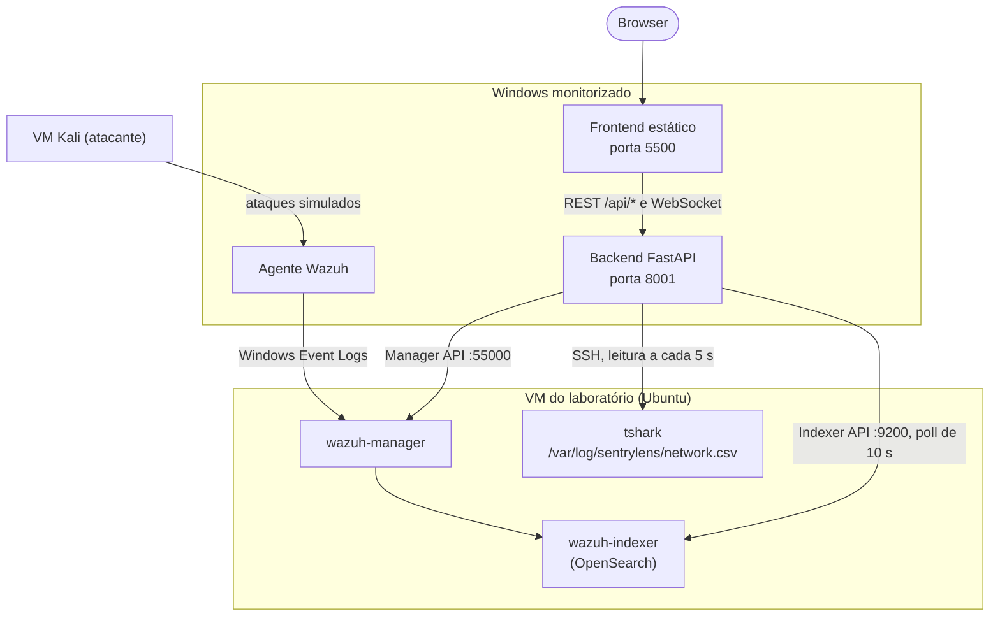

# SentryLens

**Dashboard de cibersegurança que junta três fontes de deteção — alertas do Wazuh, tráfego de rede e Machine Learning — e mede o quão bem detetam ataques simulados.**

<p align="center">
  
</p>

<p align="center">
  
  
  
  
</p>

O SentryLens liga-se a um laboratório [Wazuh](https://wazuh.com/) (SIEM open-source) e mostra, quase em tempo real, os alertas de segurança gerados pelos Windows Security Event Logs de uma máquina monitorizada. Cada evento aparece com nome legível, severidade e recomendação de ação, em vez de um Event ID numérico.

Além dos alertas, o projeto:

- captura e analisa **tráfego de rede** do laboratório (tshark/Wireshark);
- aplica um modelo de **Machine Learning** (Isolation Forest) como segunda opinião sobre os mesmos alertas;
- avalia cada alerta contra o **RGPD, a NIS2 e o AI Act**;
- cruza **ataques simulados (Red Team)** com o que foi detetado (Blue Team), medindo cobertura e tempo até à deteção.

Nasceu como projeto do curso de cibersegurança do CET e foi pensado como laboratório de aprendizagem: tudo corre localmente, numa VM, sem serviços externos.

---

## Como funciona

O SentryLens tem três camadas de deteção que olham para o mesmo laboratório de ângulos diferentes:

| Camada | O que vê | Como |
|---|---|---|
| **Wazuh** | Logs do host (Windows Event IDs) | O agente envia os eventos ao Wazuh Manager; o backend consulta o Manager e o Indexer por API e classifica cada alerta por regras. |
| **Rede (tshark / Wireshark)** | Tráfego entre o atacante e os alvos | O `tshark` corre na VM e grava metadados de cada pacote num ficheiro CSV. O backend lê esse ficheiro por SSH a cada 5 s e deteta padrões suspeitos. |
| **Machine Learning** | Comportamento fora do normal | Um Isolation Forest avalia cada alerta com 7 features (hora, Event ID, falhas recentes, IP novo, etc.). |

Nenhuma camada substitui as outras: o Wazuh não vê o tráfego de rede, e as regras só apanham o que alguém previu.


```mermaid
flowchart TB
    KALI["VM Kali (atacante)"]

    subgraph WIN["Windows monitorizado"]
        AGENT["Agente Wazuh"]
        BACKEND["Backend FastAPI<br/>porta 8001"]
        FRONTEND["Frontend estático<br/>porta 5500"]
    end

    subgraph VM["VM do laboratório (Ubuntu)"]
        MANAGER["wazuh-manager"]
        INDEXER["wazuh-indexer<br/>(OpenSearch)"]
        TSHARK["tshark<br/>/var/log/sentrylens/network.csv"]
    end

    BROWSER(["Browser"])

    KALI -->|"ataques simulados"| AGENT
    AGENT -->|"Windows Event Logs"| MANAGER
    MANAGER --> INDEXER
    BACKEND -->|"Manager API :55000"| MANAGER
    BACKEND -->|"Indexer API :9200, poll de 10 s"| INDEXER
    BACKEND -->|"SSH, leitura a cada 5 s"| TSHARK
    BROWSER --> FRONTEND
    FRONTEND -->|"REST /api/* e WebSocket"| BACKEND
```

O backend nunca fala diretamente com o agente: usa as APIs do Wazuh, que já têm os alertas processados.

---

## Funcionalidades

O dashboard tem 17 abas:

| Aba | Conteúdo |
|---|---|
| **Visão Geral** | KPIs (total, severidade, agentes ativos), resumo do sistema e gráficos |
| **Alertas** | Alertas classificados, com deteção de força bruta (Event ID 4625) |
| **Agentes** | Agentes Wazuh: nome, IP, SO, estado e último keep-alive |
| **Sistema** | CPU, RAM, disco e rede da máquina local, com histórico de violações de limiar |
| **Ciclo de Vida** | Criação, alteração e remoção de contas, com deteções de risco |
| **Privilégios** | Desvios RBAC face a uma baseline de cargos e grupos permitidos |
| **Contas Admin** | Atividade das contas administrativas: privilégios especiais, tarefas agendadas |
| **ML Anomalias** | Isolation Forest lado a lado com a classificação por regras |
| **Conformidade** | Veredito RGPD, NIS2 e AI Act por alerta |
| **Red vs Blue** | Ataques simulados vs. deteções, e rede em tempo real |
| **Live SOC** | Feed de alertas ao vivo e saúde do SIEM (Manager/Indexer, agentes, atraso de ingestão) |
| **Incidentes** | Agrupamento automático de alertas e deteções de rede em incidentes, com estados, timeline e notas |
| **Attack Registry / Attack Timeline** | Registo de ataques: esperado vs. real (regra/ML/rede) e incidentes ligados; só leitura |
| **Attack Library** | Catálogo de referência dos cenários de ataque (risco, sensores esperados, limpeza); só leitura, nunca executa nada |
| **Live Traffic / Network Detections / PCAP Evidence** | Resumos dedicados da captura de rede e evidência de metadados persistida (nunca payload nem PCAP real) |

Também inclui:

- Classificação de 23 Event IDs do Windows Security Log.
- Atualização em tempo real por WebSocket (`/ws/alerts`), com *fallback* para polling de 30 s.
- Histórico próprio em JSONL com índice SQLite, para além dos 90 dias do Wazuh Indexer.
- Exportação de um relatório HTML autónomo (`GET /api/export/report`).
- Autenticação por API key em todos os endpoints.
- Vista unificada de deteções (`GET /api/detections`): regra, ML e rede num tipo comum (`DetectionEvent`).
- Triagem experimental de incidentes via JEV (`POST /api/incidents/{id}/triage`): desligada por omissão e anonimizada.

---

## Conformidade: como é disparada

A conformidade não depende de ninguém a pedir. Corre automaticamente para cada alerta novo:

1. O backend consulta o Wazuh Indexer a cada **10 segundos** e identifica os alertas ainda não vistos (deduplicação pelo `_id` do documento).
2. Para cada alerta novo, avalia o **RGPD**, a **NIS2** e o **AI Act** com o perfil da organização e as regras de `scripts/compliance_rules.yaml`.
3. Grava o alerta e o veredito em ficheiros JSONL e indexa-os em SQLite, para consulta rápida.

O resultado de cada norma é sempre explícito — `aplicavel` ou `verificado_e_nao_aplicavel` — acompanhado de uma justificação. Nunca há um veredito em branco.

| Norma | Quando se aplica |
|---|---|
| **RGPD** | A categoria do alerta envolve dados pessoais: autenticação, gestão de grupos, ciclo de vida de contas ou atividade privilegiada. |
| **NIS2** | A entidade está classificada como sujeita à NIS2 **e** o alerta é de severidade crítica ou alta, o que pode exigir comunicação ao CNCS. |
| **AI Act** | O perfil da organização tem um componente de IA ativo (aqui, o Isolation Forest). Depende só do perfil, não do alerta. |

Os mesmos vereditos estão disponíveis sob pedido em `GET /api/compliance` e no relatório exportado.

> O perfil da organização (`scripts/org_profile.py`) é fixo, porque o projeto é um laboratório e não uma empresa real. No perfil incluído a entidade **não** está classificada como sujeita à NIS2, por isso esse veredito devolve "não aplicável" até alterares o perfil. O AI Act devolve sempre "aplicável" enquanto o modelo de ML estiver ativo.

---

## Red vs Blue

A aba **Red vs Blue** responde à pergunta "quanto do que atacámos foi detetado?".

- **Red Team:** `scripts/attack_scenarios.py` corre-se manualmente na VM Kali contra o agente Windows. Cada tentativa fica registada em `attack_log.jsonl`, com a técnica MITRE ATT&CK. Há 5 cenários: `smb_enum`, `blank_password_check`, `account_lockout_spray`, `lateral_movement_schtasks` e `brute_force_rdp`.
- **Blue Team:** um alerta conta como deteção de uma tentativa se o IP do agente coincidir com o alvo **e** o Event ID for um dos esperados para esse cenário, dentro de uma janela de tempo (300 s por omissão).
- **Métricas:** cobertura, tempo médio até à deteção (MTTD) e se o ataque foi apanhado por regra, por ML, por ambos ou por nenhum.
- **Rede em tempo real:** painel com os pacotes e as deteções de rede mais recentes.

As deteções de rede (`scripts/network_detections.py`) usam limiares fixos:

| Deteção | Condição |
|---|---|
| Port scan | 15 ou mais portos de destino distintos, do mesmo origem para o mesmo destino, em 30 s |
| Brute force | 20 ou mais tentativas de ligação ao mesmo porto, em 30 s |
| Pico de volume | 500 ou mais pacotes do mesmo IP de origem em 10 s |

Só conta como tentativa de ligação um pacote TCP com SYN e sem ACK, para as respostas do alvo não serem confundidas com um segundo ataque.

---

## Machine Learning

O painel **ML Anomalias** usa um `IsolationForest` (scikit-learn), um modelo não supervisionado: aprende o que é um alerta normal neste ambiente e assinala o que se afasta disso. Serve de **segunda opinião** sobre as regras, não de substituto.

Resultados do primeiro ciclo com dados reais do laboratório (14 set 2026; 5 ataques lançados a partir do Kali, 35 eventos processáveis, 20 rotulados como ataque):

| | Precisão | Recall | F1 |
|---|---|---|---|
| ML (Isolation Forest) | 0,86 | 0,30 | 0,44 |
| Regras (`event_catalog.py`) | 0,88 | 0,35 | 0,50 |

**Atenção ao que isto significa:** a amostra é pequena, por isso não é uma estimativa de desempenho em produção. O ML não é melhor do que as regras; o interesse está em os dois falharem em sítios diferentes (5 alertas marcados por ambos, 2 só pelo ML, 3 só pelas regras) e em essa diferença ser mensurável.

Para treinar o modelo:

```bash
cd scripts
python train_anomaly_model.py
```

Isto escreve `models/isolation_forest.pkl` e `models/scaler.pkl`, que não são versionados. Até existirem, `GET /api/ml-anomalies` devolve `503`. Metodologia, features e o ciclo de validação completo estão em [`docs/ML.md`](docs/ML.md).

---

## Início rápido

### Pré-requisitos

- Python 3.12 ou superior.
- Um laboratório Wazuh acessível por rede: uma VM Ubuntu Server 22.04 com Wazuh instalado, em VirtualBox ou Hyper-V. O guia [`docs/LAB_WAZUH_HYPERV.md`](docs/LAB_WAZUH_HYPERV.md) descreve a montagem passo a passo.
- Windows 10/11 como máquina monitorizada (a monitorização do sistema local usa WMI/PowerShell).
- Opcional, para a captura de rede: `tshark` na VM e acesso SSH por chave. O serviço de exemplo está em `scripts/deploy/`.
- Opcional, para os ataques simulados: uma VM Kali.

### 1. Configurar o backend

```bash
cd scripts
python -m venv .venv
.venv\Scripts\activate          # Windows (PowerShell/cmd)
pip install -r requirements.txt
cp .env.example .env            # depois edita com os valores reais
```

No `.env` define, no mínimo, o endereço e as credenciais do Wazuh e a API key:

```env
WAZUH_MANAGER_URL=https://<IP_DA_VM>:55000
WAZUH_MANAGER_USER=wazuh-wui
WAZUH_MANAGER_PASSWORD=<password>

WAZUH_INDEXER_URL=https://<IP_DA_VM>:9200
WAZUH_INDEXER_USER=admin
WAZUH_INDEXER_PASSWORD=<password>

# Obrigatória: sem ela, todos os pedidos a /api/* devolvem 401
SENTRYLENS_API_KEY=<valor aleatório forte, ex.: openssl rand -hex 32>
```

As passwords do Wazuh estão no ficheiro gerado durante a instalação, dentro da VM:

```bash
sudo tar -O -xvf wazuh-install-files.tar wazuh-install-files/wazuh-passwords.txt
```

Para ativar a captura de rede, preenche também `VM_SSH_HOST`, `VM_SSH_USER` e `VM_SSH_KEY_PATH`. Com `VM_SSH_HOST` vazio, essa funcionalidade fica desligada e o resto continua a funcionar.

Arranca o backend:

```bash
uvicorn main:app --port 8001
```

Confirma que está de pé:

```bash
curl -H "X-API-Key: <a tua chave>" http://localhost:8001/api/health
```

A porta por omissão é a **8001**, porque a 8000 costuma estar ocupada por outros serviços. Sem o header, o pedido devolve `401`.

### 2. Servir o frontend

O frontend é HTML/CSS/JavaScript puro, sem passo de build. Define em `app.js` a constante `API_KEY` com o mesmo valor do `.env` e serve-o por HTTP:

```bash
cd scripts
python serve_frontend.py 5500
```

Abre `http://localhost:5500/index.html`.

Não abras o `index.html` com duplo-clique: o CORS do backend só aceita `localhost`/`127.0.0.1`, e um ficheiro aberto diretamente envia `Origin: null`. Também não uses `python -m http.server` a partir da raiz do repositório, porque expõe o `scripts/.env` com as credenciais. O `serve_frontend.py` serve apenas uma lista fixa de ficheiros e só escuta em `127.0.0.1`.

Os scripts `scripts/start-backend.ps1` e `scripts/start-frontend.ps1` arrancam cada um dos serviços em segundo plano e podem ser ligados a uma tarefa agendada do Windows para arrancar no início de sessão.

### Fase 1: análise de ficheiros de log

O projeto começou com um analisador de logs estáticos, sem dependências externas, que partilha a mesma classificação de Event IDs:

```bash
python log_analyzer.py --input sample_events.json --output report.html
```

Ver [`QUICKSTART.md`](QUICKSTART.md).

---

## Testes

31 scripts standalone, sem pytest (`python run_all_tests.py` corre-os todos em paralelo). Correm sem laboratório, porque o Wazuh e o SSH estão simulados. Cada um imprime `[OK]` ou `[FALHOU]` por caso e termina com código 1 se algo falhar.

```bash
cd scripts
python test_with_mock.py        # classificação, /api/stats, /api/brute-force
python test_auth.py             # autenticação por API key
python test_compliance.py       # motor RGPD/NIS2/AI Act
python test_ml_anomalies.py     # /api/ml-anomalies
python test_redblue.py          # correlação Red vs Blue
python test_network_detections.py
# ... e os restantes test_*.py
```

Usa o `.venv` de `scripts/`: precisam de `scikit-learn`, `joblib` e `PyYAML`.

---

## API

Todos os endpoints `/api/*` exigem o header `X-API-Key` e devolvem JSON (exceto o relatório, que devolve HTML). Os principais:

| Método | Endpoint | Descrição |
|---|---|---|
| GET | `/api/alerts` | Alertas recentes, classificados |
| GET | `/api/stats` | KPIs agregados |
| GET | `/api/compliance` | Veredito RGPD/NIS2/AI Act por alerta |
| GET | `/api/ml-anomalies` | Isolation Forest vs. regras |
| GET | `/api/redblue/metrics` | Cobertura e MTTD por cenário de ataque |
| GET | `/api/redblue/network` | Snapshot da captura de rede |
| GET | `/api/detections` | Vista unificada recente dos detetores (regra/ML/rede) |
| GET | `/api/incidents` | Incidentes (rotas `/api/incidents/*`) |
| GET | `/api/attacks` | Registo de ataques, esperado vs. real |
| GET | `/api/attack-library` | Catálogo de cenários de ataque |
| GET | `/api/network/live-traffic` \| `detections` \| `evidence` | Resumos dedicados de rede |
| GET | `/api/siem/health` | Saúde do SIEM |
| GET | `/api/history/query` | Consulta ao histórico (índice SQLite) |
| GET | `/api/export/report` | Relatório HTML autónomo |
| WS | `/ws/alerts` | Alertas novos em tempo real |
| WS | `/ws/network` | Pacotes e deteções de rede em tempo real |

Os WebSockets autenticam-se com `?api_key=...` na query string, porque os browsers não enviam headers personalizados no handshake. A lista completa, com parâmetros, está em [`docs/API.md`](docs/API.md).

---

## Segurança

- **API key obrigatória** em todos os endpoints REST, em modo *fail-closed*: sem a variável definida, tudo devolve `401`.
- **CORS restrito** a `localhost` e `127.0.0.1`.
- **Sem Swagger nem `/docs`**, de propósito: as rotas automáticas do FastAPI não passam pela proteção por API key.
- **`WAZUH_VERIFY_SSL=false` por omissão**, porque o laboratório usa o certificado autoassinado gerado pelo instalador do Wazuh. Muda para `true` se tiveres um certificado válido.
- Nunca versiones o `scripts/.env`.

---

## Estrutura do repositório

```
├── index.html, app.js, redblue.js, style.css   frontend estático
├── log_analyzer.py                              Fase 1: análise de logs estáticos
├── scripts/                                     backend FastAPI
│   ├── main.py                                  endpoints REST e WebSocket
│   ├── wazuh_client.py                          clientes do Manager e do Indexer
│   ├── event_catalog.py                         classificação de Event IDs
│   ├── compliance_evaluator.py / .yaml          motor RGPD, NIS2 e AI Act
│   ├── network_monitor.py / network_detections.py   captura e deteção de rede
│   ├── ml_anomalies.py / feature_extractor.py / train_anomaly_model.py   Machine Learning
│   ├── attack_scenarios.py / redblue_correlator.py  Red vs Blue
│   ├── incident_*.py, attack_registry.py, attack_library.py/.yaml   incidentes, registo e biblioteca de ataques
│   ├── detection_event.py, network_soc.py, siem_health.py   deteções unificadas, painéis de rede, saúde do SIEM
│   ├── history_store.py / history_index.py      histórico JSONL e índice SQLite
│   ├── deploy/                                  serviço tshark e logrotate da VM
│   └── test_*.py                                31 testes standalone
└── docs/                                        API, ML e guia do laboratório
```

---

## Limitações e próximos passos

- **API key partilhada:** não há login nem distinção entre utilizadores. Para uso real, evoluir para autenticação por utilizador.
- **Perfil da organização fixo:** a conformidade usa um perfil estático. Falta ligar `scripts/nis2_lookup.py` a dados reais de uma empresa.
- **ML com pouca amostra:** o modelo foi treinado com 35 eventos reais. Repetir os cenários de ataque ao longo de vários dias daria uma estimativa mais robusta.
- **Deteção de rede por limiares fixos:** não aprende uma linha de base do tráfego normal.
- **Só Windows:** a monitorização do sistema local usa WMI e PowerShell.

---

## Documentação

- [`docs/API.md`](docs/API.md): referência completa da API, autenticação e WebSockets.
- [`docs/ML.md`](docs/ML.md): metodologia do ML, resultados e correlação Red vs Blue.
- [`docs/LAB_WAZUH_HYPERV.md`](docs/LAB_WAZUH_HYPERV.md): montagem do laboratório (VirtualBox e Hyper-V).
- [`docs/TROUBLESHOOTING.md`](docs/TROUBLESHOOTING.md): problemas conhecidos.
- [`scripts/README.md`](scripts/README.md): scripts de automação do laboratório.
- [`HARDENING_CHECKLIST.md`](HARDENING_CHECKLIST.md) e [`INCIDENT_RESPONSE.md`](INCIDENT_RESPONSE.md): referências autónomas.
