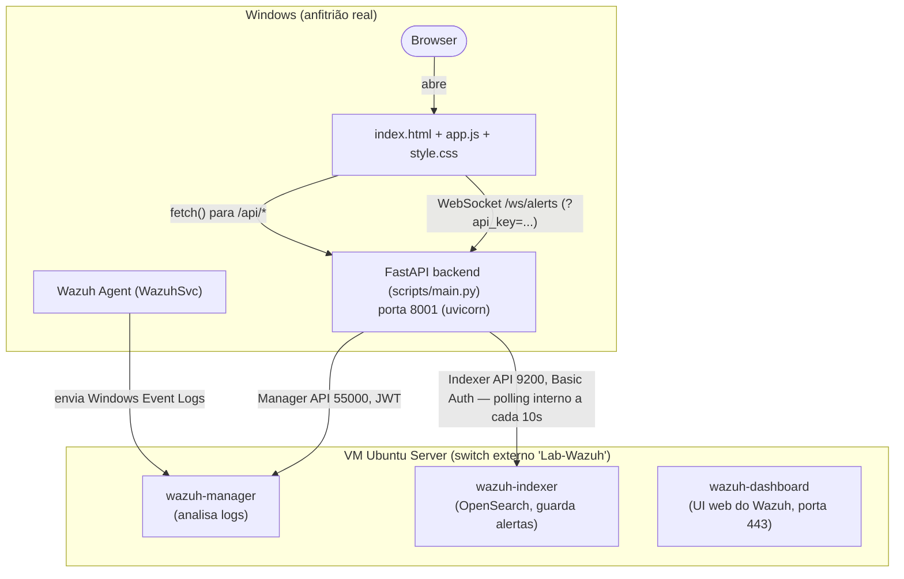

# 🔒 SentryLens

**Dashboard de Cibersegurança — Projeto CET (curso de cibersegurança)**

<p align="center">
  
</p>

<p align="center">
  
  
  
  
</p>

SentryLens é um dashboard que liga a um laboratório Wazuh real (SIEM
open-source) e mostra, em tempo quase-real, os alertas de segurança
gerados pelos Windows Security Event Logs de uma máquina monitorizada —
com nome amigável, severidade e recomendação de ação para cada tipo de
evento, em vez de IDs numéricos crus.

O projeto tem duas fases que partilham a mesma lógica de classificação:

| Fase | O que faz | Onde está |
|---|---|---|
| **Fase 1** | Analisa ficheiros de log estáticos (JSON ou CSV) e gera um relatório HTML | [`log_analyzer.py`](log_analyzer.py) — ver [`QUICKSTART.md`](QUICKSTART.md) |
| **Fase 2** *(este repo)* | Liga-se ao vivo a um laboratório Wazuh (VirtualBox/Hyper-V) via API e mostra os alertas num dashboard web | `scripts/` (backend) + `index.html` / `app.js` / `style.css` (frontend) |

A classificação de Event ID → nome amigável / severidade / recomendação
é a mesma lógica da Fase 1, centralizada em `scripts/event_catalog.py`.

### Stack técnica

| Camada | Tecnologia |
|---|---|
| Backend | Python 3.12+, [FastAPI](https://fastapi.tiangolo.com/) 0.115.0, Uvicorn 0.32.0 |
| Integração SIEM | Wazuh (Manager API + Indexer API/OpenSearch) via `httpx` |
| Tempo real | WebSocket nativo do FastAPI (`/ws/alerts`) |
| Persistência | JSONL (histórico bruto/conformidade) + SQLite (índice de consulta) |
| Machine Learning | scikit-learn 1.5.2 (Isolation Forest) |
| Frontend | HTML/CSS/JavaScript puro (sem framework nem build step), Chart.js |
| Testes | 26 scripts standalone (`scripts/test_*.py`) — sem pytest, ver [Testes](#-testes) |
| SO alvo | Windows 10/11 (WMI/PowerShell para specs do sistema) |

---

## Arquitetura


```mermaid
flowchart TB
    subgraph WIN["Windows (anfitrião real)"]
        AGENT["Wazuh Agent (WazuhSvc)"]
        BROWSER(["Browser"])
        FRONTEND["index.html + app.js + style.css"]
        BACKEND["FastAPI backend (scripts/main.py)<br/>porta 8001 (uvicorn)"]
    end

    subgraph VM["VM Ubuntu Server (switch externo 'Lab-Wazuh')"]
        MANAGER["wazuh-manager<br/>(analisa logs)"]
        INDEXER["wazuh-indexer<br/>(OpenSearch, guarda alertas)"]
        DASHBOARD["wazuh-dashboard<br/>(UI web do Wazuh, porta 443)"]
    end

    BROWSER -->|abre| FRONTEND
    FRONTEND -->|"fetch() para /api/*"| BACKEND
    FRONTEND -->|"WebSocket /ws/alerts (?api_key=...)"| BACKEND
    BACKEND -->|"Manager API 55000, JWT"| MANAGER
    BACKEND -->|"Indexer API 9200, Basic Auth — polling interno a cada 10s"| INDEXER
    AGENT -->|"envia Windows Event Logs"| MANAGER
```

O backend nunca fala diretamente com o agente — consulta as duas APIs do
Wazuh Manager/Indexer, que já têm os alertas processados.

> ⚠️ A VM `Wazuh-Manager` usada neste PC corre em **VirtualBox**
> (`VBoxManage list vms` confirma-o), não em Hyper-V — os scripts de
> setup (`setup-hyperv-lab.ps1`) e o guia
> [`docs/LAB_WAZUH_HYPERV.md`](docs/LAB_WAZUH_HYPERV.md) descrevem o
> caminho Hyper-V, mas endpoints/portas/credenciais são iguais em
> qualquer um dos dois hypervisors; só o arranque automático (ver
> [Arranque automático](#-arranque-automático)) usa `VBoxManage`.

---

## Funcionalidades

- **Dashboard web com 17 abas** (inclui **🧩 Incidentes**, R3, **🗂️ Attack Registry / 🕒 Attack Timeline**, R4, **📚 Attack Library**, R5, e **📡 Live Traffic / 🚦 Network Detections / 🧪 PCAP Evidence**, R6) — ver tabela em [Servir o frontend](#3-servir-o-frontend).
- **Classificação de 23 Event IDs** do Windows Security Log em nome
  amigável + severidade + recomendação — ver
  [`docs/API.md`](docs/API.md#catálogo-de-event-ids-scriptsevent_catalogpy).

### 🔴 Monitorização em Tempo Real — Wazuh + Wireshark

- **WebSocket de alertas** (`/ws/alerts`): push imediato de alertas novos do Wazuh
  conforme chegam, com fallback automático para polling a cada 30s se a ligação
  falhar. Estado da ligação em tempo real no canto superior direito do dashboard.
- **Captura de rede ao vivo** (`/ws/network`): snapshot do buffer de pacotes (SYN/ACK/data)
  com deteção de padrões suspeitos (port scans, brute-force SSH, anomalias de volume),
  capturado via WMI/Wireshark. Janela de 7 dias. Ver [Rede em tempo real](#-rede-em-tempo-real).
- **Deteção de anomalias por Machine Learning** (Isolation Forest): lado a lado com
  a classificação por regras — dois pontos de vista sobre os mesmos alertas.
  Retreinável com `scripts/train_anomaly_model.py` — ver [Treino de ML](#-treino-de-ml).

### 🎯 Correlação Red vs Blue (Fase 11)

- **Aba Red vs Blue**: correlação entre log de ataques simulados e alertas reais,
  com cobertura e MTTD por cenário de ataque e técnica MITRE. 4 painéis:
  - **Red Team**: log de ataques (`launched`, `failed`, `skipped`)
  - **Blue Team**: deteção por cenário, cobertura e MTTD
  - **Rede em tempo real**: snapshot + push de pacotes e deteções (Wireshark)
  - **Manager/Auditor**: estado do backend e agentes
- Guia completo: [`docs/ML.md#-correlação-red-vs-blue`](docs/ML.md#-correlação-red-vs-blue-getapiredbluemetrics-fase-11)

### Outras funcionalidades

- **Autenticação por API key** em todos os endpoints `/api/*`.
- **Persistência própria de histórico** de alertas (JSONL + índice SQLite),
  para além dos 90 dias de retenção do Wazuh Indexer.
- **Exportação de relatório HTML** autónomo (`GET /api/export/report`) — CSS embutido,
  zero recursos externos.
- **Avaliação de conformidade regulatória** (RGPD/NIS2/AI Act) por alerta.
- **Classificação NIS2 sugerida** a partir de CAE/colaboradores/faturação
  já conhecidos (sem pesquisa automática online).
- **Monitorização detalhada do sistema local** (CPU, RAM, disco físico por
  modelo/SSD-HDD, rede, interfaces ativas) via WMI/PowerShell.
- **Arranque automático** neste PC (VM + backend + frontend, ao
  iniciar sessão) — ver [secção dedicada](#-arranque-automático).

> ⚠️ Sem distinção entre múltiplos utilizadores — a API key é
> partilhada, não é login (ver [Próximos passos](#-próximos-passos)).

---

## 📁 Estrutura do repositório

```
Dashboard cybersec/
├── README.md                    ← este ficheiro
├── CLAUDE.md                    ← instruções do projeto para o Claude Code
├── index.html / app.js / style.css ← frontend
├── logo.png
│
├── log_analyzer.py              ← Fase 1: analisa logs estáticos, gera relatório HTML
├── sample_events.json / report.html / report.json / QUICKSTART.md ← Fase 1
├── HARDENING_CHECKLIST.md       ← checklist de hardening Windows, referência autónoma
├── INCIDENT_RESPONSE.md         ← playbook de resposta a incidentes, referência autónoma
│
├── scripts/                     ← backend FastAPI + automação do laboratório
│   ├── main.py                  ← app FastAPI, endpoints REST + WebSocket
│   ├── wazuh_client.py          ← cliente para Manager API + Indexer API
│   ├── event_catalog.py         ← classificação de Event IDs
│   ├── websocket_alerts.py      ← ConnectionManager + alert_poll_loop (/ws/alerts, 10s)
│   ├── network_detections.py    ← deteção de padrões suspeitos de rede (port scan/brute force/volume)
│   ├── ssh_client.py            ← VMSSHClient, único ponto de SSH com a VM
│   ├── network_monitor.py       ← parsing/buffer/poll loop de rede (/ws/network, 5s)
│   ├── history_store.py         ← persistência JSONL (alerts.jsonl, compliance.jsonl)
│   ├── history_index.py         ← índice SQLite sobre o histórico
│   ├── compliance_evaluator.py / compliance_rules.yaml / org_profile.py ← motor RGPD/NIS2/AI Act
│   ├── nis2_lookup.py           ← classificação NIS2 sugerida (sem scraping)
│   ├── report_generator.py      ← gerador de relatório HTML autónomo
│   ├── lifecycle.py / rbac.py / admin_activity.py ← painéis de ciclo de vida/RBAC/admin
│   ├── ml_anomalies.py / feature_extractor.py / train_anomaly_model.py ← deteção por ML
│   ├── redblue_correlator.py    ← correlação Red vs Blue (Fase 11)
│   ├── incident_engine.py / incident_store.py / incident_ingest.py ← incidentes (R3)
│   ├── attack_registry.py       ← registo de ataques, esperado vs real (R4)
│   ├── attack_library.py / attack_library.yaml ← catálogo de referência de ataques, só leitura (R5)
│   ├── network_soc.py           ← resumos puros p/ Live Traffic/Network Detections/PCAP Evidence (R6)
│   ├── system_monitor.py        ← specs/saúde da máquina local
│   ├── test_*.py                ← 27 scripts de teste standalone (ver Testes)
│   ├── requirements.txt         ← dependências Python do backend
│   ├── .env / .env.example      ← credenciais reais (não versionar) / template
│   ├── README.md                ← guia dos scripts de automação do laboratório
│   ├── setup-hyperv-lab.ps1     ← 1) cria Hyper-V switch + VM (Windows, Admin)
│   ├── install-wazuh.sh         ← 2) instala o Wazuh dentro da VM (via SSH)
│   ├── install-wazuh-agent.ps1  ← 3) instala o agente no Windows (Admin)
│   ├── start-backend.ps1 / start-frontend.ps1 ← wrappers das tarefas agendadas
│   └── historico/ · models/     ← dados gerados em runtime (gitignored)
│
└── docs/
    ├── README.md                ← guia legado (estrutura antiga) — ver aviso no topo do ficheiro
    ├── LAB_WAZUH_HYPERV.md      ← guia passo-a-passo do laboratório (VirtualBox e Hyper-V)
    ├── API.md                   ← documentação completa da API
    ├── ML.md                    ← deteção de anomalias por Machine Learning
    └── TROUBLESHOOTING.md       ← lista completa de problemas conhecidos
```

---

## ✅ Pré-requisitos

- Windows 10/11 Pro, Enterprise ou Education (Hyper-V não existe na
  edição Home) — ou VirtualBox, se seguires o caminho usado neste PC.
- Virtualização de hardware (Intel VT-x / AMD-V) ativa na BIOS/UEFI.
- Python 3.12+ instalado e no PATH.
- Uma VM Ubuntu Server 22.04 LTS com Wazuh instalado, acessível na
  rede local (ver secção seguinte).

---

## 1. Montar o laboratório Wazuh

Guia completo: [`docs/LAB_WAZUH_HYPERV.md`](docs/LAB_WAZUH_HYPERV.md).
Resumo dos 3 scripts automatizados, **corridos manualmente por esta
ordem** (nunca em automático — envolvem reiniciar o PC e mexer em
virtualização):

| # | Script | Onde corre | O que automatiza |
|---|---|---|---|
| 1 | `scripts/setup-hyperv-lab.ps1` | Windows anfitrião (PowerShell, Admin) | Ativa Hyper-V, cria o Virtual Switch `Lab-Wazuh` (externo) e a VM (Geração 2, 8 GB RAM, 4 vCPU, 60 GB disco dinâmico, Secure Boot desativado) |
| — | *(manual)* instalação do Ubuntu Server | Consola Hyper-V | Interativo de propósito — idioma, disco, utilizador, e marcar **"Install OpenSSH server"** |
| 2 | `scripts/install-wazuh.sh` | Dentro da VM Ubuntu (via SSH) | `apt update/upgrade`, `wazuh-install.sh -a`, mostra as passwords geradas, confirma manager/indexer/dashboard `active (running)` |
| — | *(manual)* login no Dashboard Wazuh | Browser do Windows | `https://<IP_DA_VM>` → aceitar certificado autoassinado → login `admin` |
| 3 | `scripts/install-wazuh-agent.ps1 -WazuhManagerIP <IP_DA_VM>` | Windows a monitorizar (PowerShell, Admin) | Descarrega o MSI do agente, instala silenciosamente, arranca `WazuhSvc`, confirma `Running` |
| — | *(manual)* validação final | Wazuh Dashboard | Management → Endpoints → agente `Active`; gerar logon falhado de propósito e confirmar `rule.id 60122` / Event ID `4625` em Threat Hunting |

Detalhes de cada parâmetro (`Get-Help .\setup-hyperv-lab.ps1 -Full`) e a
lista de passos propositadamente **não** automatizados estão em
[`scripts/README.md`](scripts/README.md).

---

## 2. Configurar e correr o backend

```bash
cd scripts
pip install -r requirements.txt
cp .env.example .env    # depois editar com os valores reais
```

Editar `scripts/.env`:

```env
# Wazuh Manager API (porta 55000)
WAZUH_MANAGER_URL=https://<IP_DA_VM>:55000
WAZUH_MANAGER_USER=wazuh-wui
WAZUH_MANAGER_PASSWORD=<password real>

# Wazuh Indexer API (porta 9200)
WAZUH_INDEXER_URL=https://<IP_DA_VM>:9200
WAZUH_INDEXER_USER=admin
WAZUH_INDEXER_PASSWORD=<password real>

# Obrigatória — sem ela, todos os pedidos a /api/* são recusados com 401
SENTRYLENS_API_KEY=<gerar, ver secção Autenticação por API key>
```

Ambas as passwords do Wazuh vêm do ficheiro gerado durante a instalação
(dentro da VM):

```bash
sudo tar -O -xvf wazuh-install-files.tar wazuh-install-files/wazuh-passwords.txt
```

Correr o backend:

```bash
uvicorn main:app --reload --port 8001
```

Confirmar que está de pé:

```bash
curl -H "X-API-Key: <a tua SENTRYLENS_API_KEY>" http://localhost:8001/api/health
# {"status":"ok","timestamp":"2026-08-28T21:47:37.019106"}
```

Sem o header, este pedido devolve `401`.

> Não há documentação interativa (Swagger/`/docs`) — desativada de
> propósito (`docs_url=None` em `main.py`), porque as rotas automáticas
> do FastAPI não passam pela mesma proteção de API key das rotas
> registadas via `@app.get`/`@app.post`.

### Nota sobre a porta 8000

Neste PC, a porta 8000 já está ocupada por um serviço Windows de
terceiros (`httpd.exe`, serviço `IBXDashboard`, sem relação com este
projeto) — por isso o backend usa **8001** como porta default.

---

## 🚀 Arranque automático

Configurado neste PC para que, ao iniciar sessão, tudo suba sozinho:

| # | O quê | Onde | Como |
|---|---|---|---|
| 1 | VM `Wazuh-Manager` arranca em headless | Windows Task Scheduler | Tarefa `Wazuh-Manager-VM`, `VBoxManage startvm "Wazuh-Manager" --type headless` |
| 2 | `wazuh-manager` resiste a falhar no boot | VM (systemd override) | `Restart=on-failure`, `RestartSec=15` (mitiga race condition com o Indexer a arrancar ao mesmo tempo) |
| 3 | Backend FastAPI arranca em segundo plano | Windows Task Scheduler | Tarefa `SentryLens-Backend`, corre `scripts/start-backend.ps1` (logs em `scripts/backend.log`) |
| 4 | Frontend arranca e abre no browser | Windows Task Scheduler | Tarefa `SentryLens-Frontend`, atraso de 10s, corre `scripts/start-frontend.ps1` (logs em `scripts/frontend.log`) |

Gerir as tarefas: `Get-ScheduledTask -TaskName "SentryLens-Backend","SentryLens-Frontend","Wazuh-Manager-VM"`
no PowerShell, ou pela app "Agendador de Tarefas" do Windows.

É normal, nos primeiros 1–3 minutos depois do login, os endpoints
devolverem `502` enquanto a VM e os serviços Wazuh ainda estão a
arrancar.

---

## 3. Servir o frontend

O frontend é HTML/CSS/JS puro, na raiz do repo. `app.js` aponta para
`API_BASE = "http://localhost:8001"`.

**Opção A — automático (já configurado neste PC):** a tarefa
`SentryLens-Frontend` serve o frontend em `localhost:5500` e abre o
browser sozinha — ver [Arranque automático](#-arranque-automático).

**Opção B — servidor estático manual:**

```bash
python -m http.server 5500
```

Depois abrir `http://localhost:5500/index.html`.

**Opção C — abrir diretamente (não recomendado):** duplo-clique em
`index.html` não funciona — o CORS do backend está restrito a
`localhost`/`127.0.0.1`, e `file://` envia `Origin: null`, que essa
restrição não reconhece de propósito. Usa a Opção A ou B.

O dashboard liga-se por WebSocket ao carregar a página e atualiza-se
imediatamente quando chega um alerta novo (ver [WebSocket em tempo
real](#-websocket-em-tempo-real-wsalerts)); o polling fixo de 30s
continua a existir só como *fallback*. O indicador no canto superior
direito mostra **● ligado ao Wazuh** (verde) ou **● sem ligação**
(vermelho, consultar a consola do browser para o erro exato).

A navegação é uma **sidebar** (Roadmap v2, R1) com grupos SOC, Red Team,
Blue Team, Network, Wazuh, Identidade (IAM), ML, Vaccines, MITRE ATT&CK,
Métricas, Relatórios e Sistema. Cada item é um painel real ou um marcador
**planeado** (badge `R<n>`) que mostra "Sem dados — ainda não implementado"
em vez de números inventados. Há deep links (`index.html#redblue`,
`#planned:Incidentes`) e em ecrãs estreitos a sidebar abre pelo botão
**☰ Menu**. Estado de cada fase em [docs/ROADMAP_STATUS.md](docs/ROADMAP_STATUS.md).

Os painéis reais continuam a ser as 14 abas abaixo:

| Aba | Conteúdo |
|---|---|
| 📊 **Visão Geral** | KPIs (total/severidade/agentes ativos), resumo do sistema, gráficos de análise |
| 🚨 **Alertas** | Banner de força bruta + tabela densa com todos os campos de cada alerta |
| 🖥️ **Agentes** | Tabela de agentes Wazuh — nome, IP, SO, estado, último keep-alive |
| ⚙️ **Sistema** | CPU/RAM/disco/rede desta máquina em detalhe, interfaces de rede, histórico de violações |
| 📋 **Ciclo de Vida** | Contagens, timeline e deteções de risco no ciclo de vida de contas |
| 🔑 **Privilégios** | Desvios RBAC — grupos atribuídos fora do baseline cargo→grupos permitidos |
| 👤 **Contas Admin** | Atividade de contas administrativas — privilégios especiais, tarefas agendadas |
| 🧠 **ML Anomalias** | Deteção por Isolation Forest lado a lado com a classificação por regras |
| 🛡️ **Conformidade** | Veredito RGPD/NIS2/AI Act por alerta, resumo agregado, perfil da organização |
| ⚔️ **Red vs Blue** | Correlação entre o log de ataques e os alertas (Fase 11, Onda 3) — 4 painéis, ver abaixo |
| 📡 **Live SOC** | Feed de alertas ao vivo (WebSocket existente, pausar/retomar) e saúde do SIEM (R2, `live_soc.js`): estado Manager/Indexer, agentes, atraso de ingestão, taxa de alertas — ver [docs/API.md](docs/API.md#-saúde-do-siem-r2) |
| 🧩 **Incidentes** | Gestão de incidentes (R3, `incidents.js`): agrupamento automático de alertas Wazuh e deteções de rede por ativo, estados NEW→CLOSED, timeline, notas e importação do histórico — ver [docs/API.md](docs/API.md#-incidentes-r3) |
| 🗂️ **Attack Registry** / 🕒 **Attack Timeline** | Registo de ataques (R4, `attack_registry.js`): operador, esperado vs real (regra/ML/rede), evidência por referência e incidentes ligados; só leitura — ver [docs/API.md](docs/API.md#️-attack-registry-r4) |
| 📚 **Attack Library** | Catálogo de referência dos cenários de ataque do laboratório (R5, `attack_library.js`): risco, pré-requisitos, sensores esperados, passos de limpeza, replayable; só leitura, nunca lança nada — ver [docs/API.md](docs/API.md#-attack-library-r5) |
| 📡 **Live Traffic** | Resumo do buffer de pacotes ao vivo (R6, `network_soc.js`): protocolos, top talkers, portas mais vistas — ver [docs/API.md](docs/API.md#-network-soc-r6) |
| 🚦 **Network Detections** | Deteções de rede "agora" vs histórico acumulado, por tipo (R6, `network_soc.js`) — mesma fonte de `network_detections.py` que o painel de rede da aba Red vs Blue |
| 🧪 **PCAP / Evidence** | Deteções de rede persistidas em JSONL (R6): resolve a dívida de R0 ("deteções só em memória"); **evidência de metadados, nunca uma exportação PCAP/payload real** — sem captura de payload, só cabeçalhos tshark |

A aba **⚔️ Red vs Blue** vive em `redblue.js` (não edita `app.js`; reutiliza
os seus globais) e usa uma janela fixa de 7 dias (168 h, o máximo de
`/api/redblue/metrics`). Tem um resumo de KPIs e 4 painéis:

- **Red Team** — o log de ataques (`GET /api/redblue/attack-log`): data,
  cenário, alvo, ferramenta, estado e técnica/tática MITRE. O log só tem os
  estados `launched`, `failed` e `skipped`.
- **Blue Team** — deteção por cenário e MTTD por técnica MITRE
  (`GET /api/redblue/metrics`). Declara que a aplicação não regista ações de
  resposta, por isso não mostra nenhuma.
- **Rede em tempo real** — snapshot de `GET /api/redblue/network` e push por
  `/ws/network`; é a vista de correlação viva deste painel (alimenta
  `/api/redblue/metrics`). Para resumos dedicados e para o histórico
  persistido de deteções (sobrevive a um restart do backend), ver as abas
  **📡 Live Traffic / 🚦 Network Detections / 🧪 PCAP Evidence** (R6,
  `network_soc.js`) — mesma fonte de dados, sem segundo poller nem segundo
  WebSocket.
- **Manager/Auditor** — estado do backend (`/api/health`) e agentes
  (`/api/agents`).

Em vez de números, a aba mostra estado vazio ou um aviso em três situações:

1. **Sem ataques na janela** — sem tentativas nos últimos 7 dias, cobertura e
   MTTD não se aplicam. As tentativas são construídas a partir de *todo* o
   log, mas os alertas só são pesquisados nos últimos 7 dias; uma tentativa
   mais antiga não pode ter correspondência, pelo que a interface mostra um
   aviso e "—" (não 0%) para ela.
2. **Captura de rede não configurada** — com `VM_SSH_HOST` vazio, o painel de
   rede mostra "captura não configurada".
3. **Modelo de ML por treinar** — aviso para correr
   `scripts/train_anomaly_model.py`.

O `serve_frontend.py` tem uma whitelist fixa de ficheiros que inclui
`/redblue.js`; é preciso reiniciar o servidor de frontend dedicado para o
passar a servir.

---

## 🧪 Testes

Sem laboratório Wazuh ligado — tudo mockado (`AsyncMock` sobre
`WazuhIndexerClient`/`WazuhManagerClient`). Sem framework (nem pytest):
26 scripts standalone em `scripts/`, cada um imprime `[OK]`/`[FALHOU]`
por caso e sai com `sys.exit(1)` se algo falhar.

### Correr todos os testes

```bash
cd scripts
# Abas principais do dashboard (Fase 1-6):
python test_with_mock.py         # classificação, /api/stats, /api/brute-force
python test_new_panels.py        # /api/lifecycle, /api/privileges, /api/admin-activity
python test_auth.py              # autenticação por API key (401/200, /docs desligado)

# WebSocket em tempo real:
python test_websocket_alerts.py  # /ws/alerts — auth por query param, _poll_once

# Persistência e relatórios:
python test_history_store.py     # persistência JSONL de histórico
python test_history_index.py     # índice SQLite + /api/history/query
python test_report_generator.py  # gerador + /api/export/report

# Monitorização do sistema:
python test_system_monitor.py    # THRESHOLDS + /api/system/thresholds

# Conformidade regulatória:
python test_compliance.py        # motor RGPD/NIS2/AI Act + /api/compliance
python test_nis2_lookup.py       # classificação NIS2 sugerida + /api/nis2-lookup

# Machine Learning — anomalias e treino:
python test_ml_anomalies.py      # /api/ml-anomalies (Isolation Forest)
python test_feature_extractor.py # extração de features para ML (não usa TestClient)

# Red vs Blue + Rede em tempo real (Fase 11):
python test_redblue.py                # correlação Red vs Blue + /api/redblue/metrics
python test_redblue_attack_log.py     # log de ataques simulados
python test_network_monitor.py        # captura de rede + /ws/network (Wireshark)
python test_network_detections.py     # deteção de port scans/brute-force/anomalias
python test_ssh_client.py             # VMSSHClient para acesso remoto

# Incidentes (R3):
python test_incident_engine.py        # regras puras de agrupamento, estados, ataque ligado
python test_incident_store.py         # SQLite, IDs diários, deduplicação, timeline append-only
python test_incident_ingest.py        # ingest de alertas/deteções de rede + resumo ML
python test_incidents_api.py          # /api/incidents/* (401/404/409/422/502, backfill)

# Attack Registry (R4):
python test_attack_registry.py        # módulo puro + /api/attacks (log antigo/corrompido, 404/422, não detetado, incidente ligado)

# Attack Library (R5):
python test_attack_library.py         # validação do YAML (fail-fast), merge com SCENARIOS, /api/attack-library (401/404/422)
python test_attack_targets.py         # allowlist de alvos fail-closed em attack_scenarios.py

# Network SOC (R6):
python test_network_soc.py            # network_soc.py puro + persistência JSONL + /api/network/* (401/422, limit capeado, "restart")

# Live SOC (R2):
python test_siem_health.py            # saúde do SIEM pura + /api/siem/health (erros, stale, truncated)
```

### Particularidades

- Todos definem `SENTRYLENS_API_KEY` em `os.environ` **antes** de `import main`
- Fazem `main.app.router.on_startup.clear()` para não arrancar os loops de background
- Correm no `.venv` de `scripts/` — o Python global desta máquina não tem
  `scikit-learn`/`joblib`/`PyYAML` instalados

---

## 🧠 Treino de ML — Isolation Forest

O painel **ML Anomalias** (aba 8) usa um modelo `IsolationForest` (scikit-learn)
que é retreinado com histórico de alertas reais de ataque. O treino é manual e
off-line — não automático.

### Retreinar o modelo

```bash
cd scripts
python train_anomaly_model.py
```

Lê histórico JSONL (`scripts/historico/`), extrai features via `feature_extractor.py`
(contagem de tentativas, intervalo médio, desvio padrão, etc.) e guarda o modelo
em `scripts/models/anomaly_model.pkl`.

### Ciclo de validação com dados reais

O projeto inclui um ciclo de teste com dados reais:

1. **Definir cenários de ataque:** `scripts/attack_scenarios.py` — scanning, brute-force,
   privilege escalation, etc. com timestamps e técnicas MITRE. Metadata de referência
   (risco, pré-requisitos, sensores esperados, cleanup) em `scripts/attack_library.yaml`
   — ver aba **📚 Attack Library** no dashboard.
2. **Simular ataques no laboratório** via Kali (dentro da VM ou externa) — scripts de
   ataque, port scans, SSH brute-force, etc. `--target` exige um alvo na allowlist
   (R5, fail-closed: loopback/IPs de documentação por omissão — ver
   `scripts/attack_targets.example.json` e `docs/SECURITY.md`).
3. **Exportar snapshot de treino:** `scripts/export_snapshot.py` — gera snapshot de época
   (data/tipo/severidade) para treino.
4. **Retreinar:** `python train_anomaly_model.py` com dados reais.
5. **Correlacionar:** Aba Red vs Blue compara a cobertura (alertas detetados por ML vs.
   regras vs. nenhum).

Metodologia, features, resultados (precisão/recall/F1) e validação cruzada em
**[`docs/ML.md`](docs/ML.md)**.

> ⚠️ Primeiro ciclo com dados reais do laboratório em 2026-09-14
> (5 cenários, 35 eventos processáveis) — amostra ainda pequena. Não é uma
> estimativa robusta de taxa de deteção em produção.

---

## 📡 Rede em Tempo Real — Captura, Deteção e Evidência (R6)

A aba **⚔️ Red vs Blue** inclui um painel de rede que captura e analisa tráfego ao
vivo; as abas dedicadas **📡 Live Traffic / 🚦 Network Detections / 🧪 PCAP Evidence**
(R6) reaproveitam os mesmos dados em painéis próprios — ver tabela de abas acima.

### Captura via SSH + tshark (VM Wazuh)

- **Módulo:** `scripts/network_monitor.py`
- **Tecnologia:** SSH para a VM Wazuh + `tshark -T fields` (não WMI local) — lê só
  campos de cabeçalho (timestamps, IPs, portas, protocolo, flags TCP), nunca o
  payload do pacote.
- **O que captura:** metadados SYN/ACK, estatísticas por porto/protocolo — sem
  conteúdo, por isso não há payload para uma exportação PCAP real (ver R6 abaixo).
- **Frequência:** polling a cada 5s (`network_poll_loop`), só ativo com `VM_SSH_HOST`
  configurado.
- **Endpoints:**
  - `GET /api/redblue/network` — snapshot do buffer ao vivo (aba Red vs Blue)
  - `GET /api/network/live-traffic` — resumo dedicado (R6, aba Live Traffic)
  - `WS /ws/network` — push em tempo real de pacotes novos e deteções

### Análise de Padrões Suspeitos

- **Módulo:** `scripts/network_detections.py`
- **O que deteta:**
  - **Port scans** — muitas portas de destino distintas no mesmo par origem/destino
  - **Força bruta** — muitos pacotes de abertura de ligação no mesmo trio origem/destino/porta
  - **Picos de volume** — muitos pacotes da mesma origem numa janela curta
- **Integração:** marca alertas no dashboard como "detetado por rede" quando um padrão
  suspeito corresponde a um evento de ataque no log Red vs Blue; resumo dedicado em
  `GET /api/network/detections` (R6, aba Network Detections).

### Evidência persistida — PCAP / Evidence (R6)

As deteções de rede deixam de existir só em memória (dívida registada em R0): cada
deteção nova é gravada em JSONL (`history_store.append_network_detection_history`,
`historico/AAAA/MM-mês/AAAA-MM-DD-network-detections.jsonl`), lida por
`GET /api/network/evidence` (`date`, `limit` ≤500). **Não é uma exportação PCAP
real** — `network_monitor.py` só lê cabeçalhos tshark, nunca payload; a resposta
declara sempre `payload_capture: false`. Ver
[docs/superpowers/specs/2026-10-07-r6-network-soc-design.md](docs/superpowers/specs/2026-10-07-r6-network-soc-design.md).

### Configuração de SSH remoto (opcional)

Para análise avançada em máquinas remotas, a captura requer uma ligação SSH com a VM:

```env
# scripts/.env
VM_SSH_HOST=<IP_DA_VM>
VM_SSH_PORT=22
VM_SSH_USER=root
VM_SSH_PRIVATE_KEY=<path para chave privada>
```

Sem SSH configurado, o painel de rede mostra "captura não configurada" e funciona
apenas com dados locais. Validação em `test_network_monitor.py` (com SSH mockado).

---

## 4. Endpoints da API

Todos os endpoints `/api/*` exigem uma API key (`X-API-Key`) e devolvem
JSON, exceto `GET /api/export/report` (devolve HTML para download).
CORS restringido a origens loopback. Documentação completa —
autenticação, WebSocket, histórico/SQLite, conformidade, NIS2 lookup,
parâmetros de cada endpoint e o catálogo de 23 Event IDs — em
**[`docs/API.md`](docs/API.md)**.

| Method | Endpoint | Descrição |
|---|---|---|
| GET | `/api/health` | Confirma que o backend está de pé |
| GET | `/api/agents` | Lista de agentes Wazuh e estado atual |
| GET | `/api/alerts` | Alertas recentes, classificados |
| GET | `/api/stats` | KPIs agregados |
| GET | `/api/brute-force` | Deteção de força bruta (Event ID 4625) |
| GET | `/api/ml-anomalies` | Deteção por Isolation Forest vs. regras — ver [docs/ML.md](docs/ML.md) |
| GET | `/api/redblue/metrics` | Correlação Red vs Blue (Fase 11) — cobertura/MTTD por cenário de ataque — ver [docs/ML.md](docs/ML.md#-correlação-red-vs-blue-getapiredbluemetrics-fase-11) |
| GET | `/api/redblue/attack-log` | Log de ataques real (`attack_log.jsonl`) + mapeamento MITRE dos cenários (Fase 11, Onda 3) — resposta: `entries`, `total`, `scenarios`; exige `X-API-Key` |
| GET | `/api/redblue/network` | Snapshot do buffer de rede ao vivo (Fase 11, Onda 2) — pacotes + deteções — ver [docs/ML.md](docs/ML.md#-correlação-red-vs-blue-getapiredbluemetrics-fase-11) |
| GET | `/api/network/live-traffic` \| `/api/network/detections` | Resumos dedicados (Live Traffic/Network Detections, R6) sobre o mesmo buffer — ver [docs/API.md](docs/API.md#-network-soc-r6) |
| GET | `/api/network/evidence` | Deteções de rede persistidas em JSONL (R6, PCAP/Evidence) — metadados só, nunca payload/PCAP real; `date`, `limit` (≤500) |
| GET | `/api/siem/health` | Saúde do SIEM (R2): `status` ok/degraded/down, `stale`, `truncated`, agentes, atraso e taxa — sempre 200, ler `status` |
| GET | `/api/incidents` | Incidentes + resumo (R3) — filtros `status`, `severity`, `hours`, `limit`, `offset` |
| GET | `/api/incidents/{id}` | Detalhe do incidente: evidências, timeline, `ml_summary` (R3) |
| POST | `/api/incidents/{id}/status` | Muda o estado `{status, note?}` (R3) |
| POST | `/api/incidents/{id}/notes` | Acrescenta nota `{text}` à timeline (R3) |
| POST | `/api/incidents/backfill` | Importa os alertas do Indexer `{days}` — idempotente (R3) |
| GET | `/api/export/report` | Relatório HTML autónomo (download) |
| GET | `/api/compliance` | Veredito RGPD/NIS2/AI Act por alerta |
| GET | `/api/nis2-lookup` | Classificação NIS2 sugerida (CAE/colaboradores/faturação) |
| GET | `/api/history/query` | Consulta o histórico via índice SQLite |
| GET | `/api/lifecycle` \| `/api/privileges` \| `/api/admin-activity` | Ciclo de vida de contas, desvios RBAC, atividade admin |
| WS | `/ws/alerts` | Push de alertas novos em tempo real (auth por query param) |
| WS | `/ws/network` | Push de pacotes e deteções de rede em tempo real (Fase 11, Onda 2, auth por query param) — ver [docs/API.md](docs/API.md#-websocket-de-rede-em-tempo-real-wsnetwork) |
| GET | `/api/system/*` | Specs, alertas, histórico e thresholds do sistema local |
| POST | `/api/system/speedtest` | Força medição de velocidade de rede |

---

## 🐛 Troubleshooting

Os 3 problemas mais comuns:

- **"● sem ligação" no frontend / erro 502** → confirma que o backend
  está a correr (`uvicorn main:app --port 8001`) e que a VM Wazuh está
  ativa (`VBoxManage list runningvms`).
- **401 Unauthorized** → `SENTRYLENS_API_KEY` não definida em
  `scripts/.env`, ou o frontend não está a ser servido por `serve_frontend.py`
  (só ele entrega `/config.js` com a chave; com `python -m http.server` o
  `API_KEY` fica vazio).
- **`uvicorn` falha na porta 8000** → usa `--port 8001` (ver [Nota
  sobre a porta 8000](#nota-sobre-a-porta-8000)).

Lista completa (CORS, WebSocket, VM sem resposta na rede, nenhum
alerta a aparecer, etc.) em
**[`docs/TROUBLESHOOTING.md`](docs/TROUBLESHOOTING.md)**.

---

## 🚀 Próximos passos

1. **Autenticação multi-utilizador** — a API key partilhada já bloqueia
   acesso não autenticado na rede local, mas não distingue
   utilizadores; para produção real, evoluir para login por utilizador
   (ex: JWT).
2. **Pesquisa automática de dados para a classificação NIS2** — a
   lógica de decisão a partir de CAE/colaboradores/faturação já
   conhecidos está feita (`scripts/nis2_lookup.py` +
   `GET /api/nis2-lookup`); falta ir buscar esses dados automaticamente
   a partir de um NIPC (ex: Racius, informacaoempresarial.pt) e ligar o
   resultado a `org_profile.py`, hoje fixo.

---

## 📚 Referências

- [`docs/API.md`](docs/API.md) — documentação completa da API (autenticação, WebSocket, histórico, conformidade, NIS2, catálogo de Event IDs).
- [`docs/ML.md`](docs/ML.md) — deteção de anomalias por Machine Learning (metodologia, resultados, retreino).
- [`docs/TROUBLESHOOTING.md`](docs/TROUBLESHOOTING.md) — lista completa de problemas conhecidos.
- [`docs/LAB_WAZUH_HYPERV.md`](docs/LAB_WAZUH_HYPERV.md) — guia completo do laboratório (VirtualBox e Hyper-V).
- [`docs/README.md`](docs/README.md) — guia legado de setup, com aviso de estrutura desatualizada no topo.
- [`scripts/README.md`](scripts/README.md) — detalhe dos 3 scripts de automação do laboratório.
- [`HARDENING_CHECKLIST.md`](HARDENING_CHECKLIST.md) e [`INCIDENT_RESPONSE.md`](INCIDENT_RESPONSE.md) — referências autónomas.
