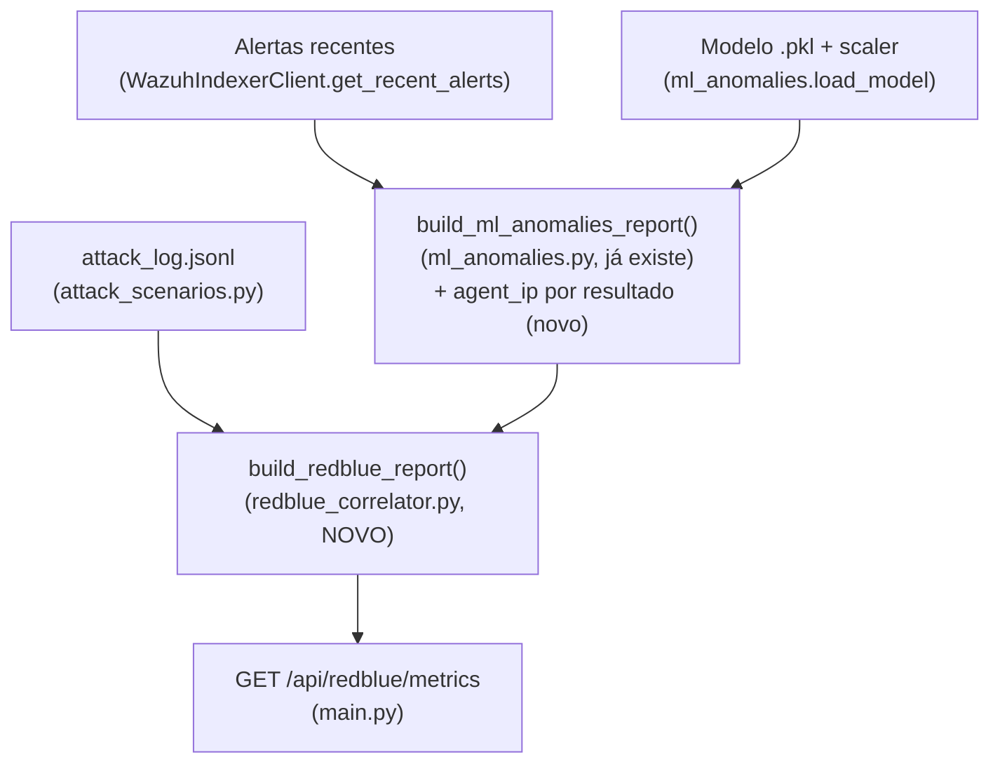

# Fase 11 (Onda 1) — Motor de Correlação Red vs Blue — Design

**Estado:** aprovado para escrita do plano de implementação
**Âmbito desta spec:** só a Onda 1 (correlator + endpoint + testes). A 10ª
aba no frontend (painéis Red Team / Blue Team / Manager-Auditor) é uma
Onda 2 deliberadamente fora de escopo aqui — só arranca depois desta onda
fechada e aprovada, com dados reais do endpoint já validados.

## Objetivo

Cruzar `attack_log.jsonl` (verdade do que a VM Kali realmente lançou,
`scripts/attack_scenarios.py`) com os alertas Wazuh classificados
(`event_catalog.py` + modelo ML de `ml_anomalies.py`) para responder, por
cenário de ataque: foi detetado? por regra, por ML, por ambos, ou por
nenhum? quanto tempo demorou a primeira deteção (MTTD)? qual a taxa de
cobertura global?

## Motivação

A Fase 6 (ML) já compara regras vs ML **por evento solto**. A Fase 11
eleva essa comparação para **por cenário de ataque conhecido** — a
pergunta interessante para um portefólio de segurança não é "este evento
é anómalo", é "este ataque específico que executámos foi apanhado, e em
quanto tempo". Reaproveita tudo o que já existe: `event_catalog.py`
(regras), o modelo `.pkl` (ML), `attack_scenarios.py` (verdade dos
ataques) — não duplica nenhuma lógica de classificação.

## Decisões já tomadas (recapitulação da conversa de brainstorming)

1. **Faseado**: esta onda só entrega o motor + endpoint, testados. Frontend
   fica para a onda seguinte.
2. **Mapeamento MITRE ATT&CK** vive dentro de `attack_scenarios.py`, no
   próprio `Scenario` dataclass — fonte única de verdade por cenário, ao
   lado do `event_ids` já existente.
3. **Regra de correspondência**: um alerta só conta como deteção de um
   ataque se o **IP do agente bater com o alvo do ataque** E o **Event ID
   estiver na lista `scenario.event_ids`** desse cenário. Mais rigoroso do
   que "qualquer alerta do agente-alvo" — evita atribuir a um cenário um
   alerta que na realidade veio de outro ataque a correr perto no tempo.
4. **ML entra já nesta onda**: o endpoint carrega o modelo `.pkl` (igual ao
   `/api/ml-anomalies`, 503 se não existir) e o relatório distingue
   deteção por regra / por ML / por ambos / por nenhum.

## Arquitetura e fluxo de dados



O correlator nunca fala com o Wazuh nem carrega o modelo — é uma função
pura, como `build_privileges_report`/`build_lifecycle_report`. Recebe o
`attack_log` já lido e o relatório já classificado de `ml_anomalies.py`.

## Componentes

### 1. `scripts/attack_scenarios.py` — mapeamento MITRE por cenário

Acrescentar dois campos ao `Scenario` dataclass, ao lado de `event_ids`:

```python
@dataclass
class Scenario:
    name: str
    description: str
    tool: str
    event_ids: list[int]
    mitre_tactic: str
    mitre_technique: str  # formato "T1110" ou "T1110.003"
    build_command: Callable[[argparse.Namespace], list[str] | None]
```

Valores para os 5 cenários existentes (do mapeamento já esboçado no
Notion, ponto de partida indicativo):

| Cenário | Tactic | Technique |
|---|---|---|
| `smb_enum` | Discovery | T1135 |
| `blank_password_check` | Credential Access | T1110 |
| `account_lockout_spray` | Credential Access | T1110.003 |
| `lateral_movement_schtasks` | Lateral Movement | T1053 |
| `brute_force_rdp` | Credential Access | T1110 |

Campos obrigatórios (sem default) — obriga a preencher para qualquer
cenário novo que apareça no futuro, consistente com o resto do
dataclass. Alteração retrocompatível de comportamento (não de schema):
`format_log_entry`/`append_attack_log`/o JSONL em si não mudam — o
mapeamento MITRE só é consultado em memória, no processo Python, nunca
serializado no log de ataques.

### 2. `scripts/ml_anomalies.py` — expor `agent_ip`

Uma linha nova no dict de cada resultado de `build_ml_anomalies_report`,
ao lado dos campos já devolvidos:

```python
"agent_ip": row.get("agent_ip"),
```

Isto implica também expor `agent_ip` em `feature_extractor.extract_features`
(hoje só devolve `source_ip`, que é o IP de origem da ligação/logon, não
o IP do próprio agente — os dois só coincidem por acaso). Acrescentar ao
dict devolvido por `extract_features`:

```python
"agent_ip": alert.get("agent", {}).get("ip", "-"),
```

Ambas as alterações são aditivas (novo campo num dict já existente) —
não quebram `test_feature_extractor.py` nem `test_ml_anomalies.py`, que
verificam presença de campos específicos, não a ausência de outros.

### 3. `scripts/redblue_correlator.py` (novo módulo)

```python
def build_redblue_report(
    attack_log: list[dict],
    ml_results: list[dict],
    scenarios: dict[str, Scenario],
    window_seconds: int = 300,
) -> dict:
```

**Pré-processamento:**
- Ignora entradas do `attack_log` com `status != "launched"` (skipped/failed
  nunca enviaram tráfego real — contá-las como "não detetadas" seria
  enganador). Contadas à parte em `not_executed` no relatório, nunca
  descartadas silenciosamente.
- Ignora entradas cujo `scenario` não conste de `scenarios` (nome
  desconhecido/renomeado) — contadas à parte em `unknown_scenario`.
- Ordena as entradas válidas por timestamp.

**Janela de correlação, por tentativa de ataque:**
`[timestamp, min(timestamp + window_seconds, timestamp_da_próxima_entrada_do_log)]`
— o limite pela próxima entrada evita atribuir a este cenário um alerta
que na verdade pertence ao ataque seguinte, mesmo com `window_seconds`
generoso. Para a última entrada do log, só o limite fixo se aplica.

**Correspondência:** dentro da janela, um resultado de `ml_results`
corresponde se `agent_ip == target` **e** `windows_event_id in
scenario.event_ids`. Entre os correspondentes:
- `detected = any` (pelo menos um correspondente)
- `detected_by`: `"both"` se algum correspondente tem `rule_flagged` **e**
  algum (pode ser outro) tem `ml_is_anomaly`; senão `"rule"` só se algum
  `rule_flagged`; senão `"ml"` só se algum `ml_is_anomaly`; senão `"none"`.
- `mttd_seconds`: `(timestamp do correspondente mais cedo) - timestamp do
  ataque`, em segundos, arredondado a 2 casas. `None` se `detected` for
  `False`.

**Saída:**

```python
{
    "attempts": [
        {
            "scenario": "smb_enum",
            "target": "192.168.1.169",
            "timestamp": "2026-09-14T15:33:20.632395+00:00",
            "mitre_tactic": "Discovery",
            "mitre_technique": "T1135",
            "detected": True,
            "detected_by": "rule",
            "mttd_seconds": 4.2,
            "matched_event_ids": [5140, 5145],
        },
        # ...
    ],
    "by_scenario": {
        "smb_enum": {
            "attempts": 1,
            "detected": 1,
            "coverage_rate": 1.0,
            "avg_mttd_seconds": 4.2,
            "detected_by_rule": 1,
            "detected_by_ml": 0,
            "detected_by_both": 0,
        },
        # ...
    },
    "overall": {
        "total_attempts": 5,
        "detected": 4,
        "coverage_rate": 0.8,
        "avg_mttd_seconds": 7.1,
    },
    "not_executed": [...],       # entradas skipped/failed do attack_log
    "unknown_scenario": [...],   # entradas com nome de cenário desconhecido
}
```

Função pura, nunca lança exceção sobre dados malformados (timestamps
inválidos são ignorados por entrada, como no resto da stack — mesma
convenção de `_parse_timestamp` usada em `lifecycle.py`/`feature_extractor.py`).
Com `attack_log` vazio ou só entradas não executadas/desconhecidas,
devolve a estrutura vazia bem formada (attempts=[], by_scenario={},
overall com zeros) — nunca `None`, nunca lança.

### 4. `scripts/main.py` — endpoint `GET /api/redblue/metrics`

```python
ATTACK_LOG_PATH = os.getenv(
    "ATTACK_LOG_PATH",
    os.path.join(os.path.dirname(__file__), "attack_log.jsonl"),
)

@app.get("/api/redblue/metrics", dependencies=_REQUIRE_API_KEY)
async def get_redblue_metrics(
    hours: int = Query(168, ge=1, le=168, description="Janela temporal em horas"),
    window_seconds: int = Query(300, ge=30, le=3600, description="Janela de correlação por ataque, em segundos"),
):
    try:
        model, scaler = ml_anomalies.load_model(ML_MODEL_DIR)
    except FileNotFoundError as e:
        raise HTTPException(status_code=503, detail=str(e))

    try:
        raw_alerts = await indexer_client.get_recent_alerts(hours=hours, size=1000)
    except Exception as e:
        raise HTTPException(status_code=502, detail=f"Erro ao contactar Wazuh Indexer: {e}")

    ml_report = ml_anomalies.build_ml_anomalies_report(raw_alerts, model, scaler)
    attack_log = load_attack_log(ATTACK_LOG_PATH)
    report = build_redblue_report(attack_log, ml_report["results"], SCENARIOS, window_seconds=window_seconds)
    report["window_hours"] = hours
    return report
```

`default hours=168` (não 24, como a maioria dos outros endpoints) porque
o `attack_log.jsonl` pode conter tentativas de dias anteriores — a defesa
"5 cenários lançados há 3 dias" só aparece com uma janela larga; o
utilizador pode sempre estreitar via query param, igual aos outros
endpoints.

`load_attack_log` e `SCENARIOS` importados de `feature_extractor` e
`attack_scenarios` respetivamente, tal como `build_redblue_report` de
`redblue_correlator`.

### 5. Testes — `scripts/test_redblue.py`

Mesmo padrão de todos os outros (`TestClient` + `AsyncMock` sobre
`get_recent_alerts`, `SENTRYLENS_API_KEY` via `setdefault` antes de
`import main`, `on_startup.clear()`, modelo ML minúsculo treinado em
memória sobre os próprios alertas mock — mesma técnica de
`test_ml_anomalies.py`). Casos a cobrir:

- Ataque com alerta correspondente dentro da janela → `detected=True`,
  `mttd_seconds` correto.
- Ataque sem qualquer alerta correspondente → `detected=False`,
  `mttd_seconds=None`, entra em `overall` como não detetado.
- Dois ataques próximos no tempo, alerta cai fora da janela do primeiro
  (cortada pelo início do segundo) → não atribuído ao primeiro.
- Alerta com IP de agente errado (não bate com o `target`) → não conta.
- Alerta com Event ID fora de `scenario.event_ids` → não conta, mesmo
  dentro da janela e com IP certo.
- Entrada `status="skipped"` → cai em `not_executed`, não conta para
  `overall.total_attempts`.
- Entrada com nome de cenário desconhecido → cai em `unknown_scenario`.
- `attack_log.jsonl` ausente → endpoint devolve 200 com relatório vazio
  (não 404/500) — mesmo comportamento que `load_attack_log` já garante.
- Modelo ML ausente → endpoint devolve 503 (igual a `/api/ml-anomalies`).
- Erro no Indexer → 502.
- `GET /api/redblue/metrics` sem `X-API-Key` → 401.

## Fora de escopo nesta onda

- Frontend (10ª aba, 3 painéis) — Onda 2, só depois desta onda aprovada.
- Classificação multi-classe / alimentar o modelo com a correlação MITRE
  formal — mencionado no Notion como possibilidade futura, não faz parte
  desta spec.
- Paginação ou índice persistente para o relatório de correlação — o
  endpoint recalcula tudo em cada pedido, como os outros painéis
  (`/api/lifecycle`, `/api/privileges`, etc.).
- Reconstrução automática se `attack_log.jsonl` for apagado/corrompido —
  mesmo tratamento que os outros ficheiros JSONL do projeto (falha
  silenciosa para lista vazia, não crash).

## Documentação

Atualizar `CLAUDE.md` (secção "Arquitetura do backend") e `README.md` com
o novo módulo/endpoint, seguindo o mesmo formato usado para
`lifecycle.py`/`rbac.py`/`admin_activity.py`. Registo de execução
apendado à página do Notion (`page_id: 3caa99e6-526b-8111-89be-db8b6ffe765b`,
nova secção "Fase 11 — Onda 1"), seguindo o mesmo formato das fases
anteriores.
