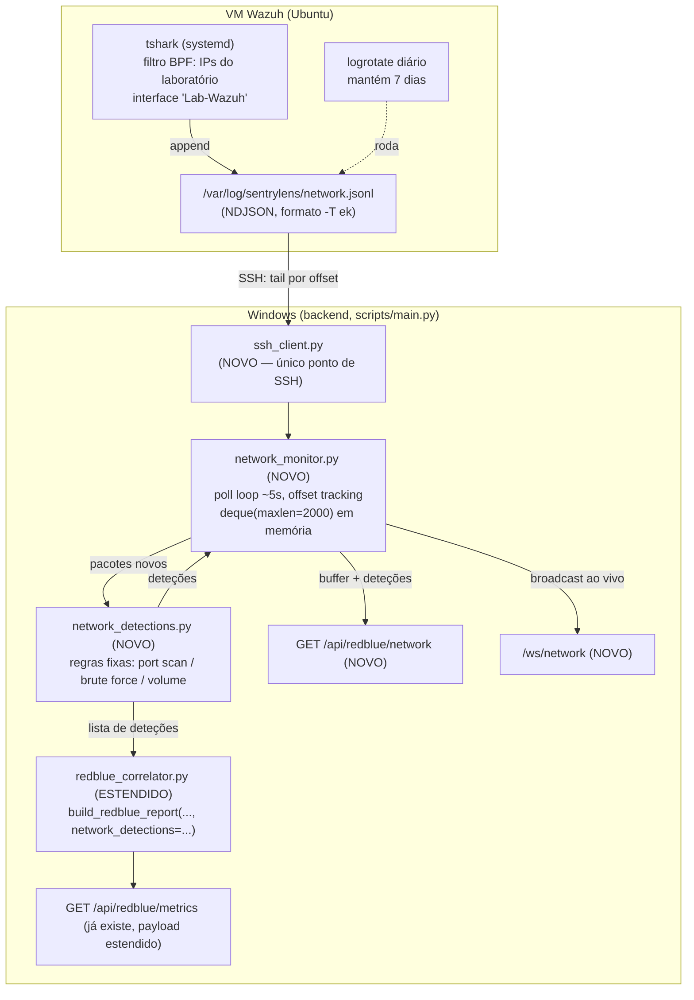

# Fase 11 (Onda 2) — Monitorização de Rede em Tempo Real (Wireshark) — Design

**Estado:** aprovado para escrita do plano de implementação
**Âmbito desta spec:** captura de rede (VM), transporte, deteção de padrões
suspeitos e extensão do correlator — backend + contrato de dados apenas.
O desenho visual da 10ª aba (painel de rede + os 3 painéis Red/Blue/
Manager-Auditor já adiados pela Onda 1) fica deliberadamente fora de
escopo aqui — Onda 3, só depois desta onda fechada e aprovada, com dados
reais dos novos endpoints já validados. Mesma disciplina incremental que
a Onda 1 já seguiu.

## Objetivo

Acrescentar uma fonte de deteção independente das que já existem (regra +
ML sobre Windows Event Logs): captura de metadados de rede na VM Wazuh,
correlacionada com `attack_log.jsonl` pelo mesmo motor que a Onda 1 já
construiu (`redblue_correlator.build_redblue_report`). O objetivo não é
visualizar pacotes — é responder "este ataque só foi detetado porque
vimos o tráfego de rede, ou o Wazuh (Windows Event Log) já o tinha
apanhado sozinho?", expondo pontos cegos de deteção.

## Motivação

A Onda 1 já mede cobertura/MTTD por regra vs ML, mas ambos partem da
mesma fonte (Windows Security Event Log via agente Wazuh) — um ataque que
não gera o evento certo (ex: reconhecimento que não chega a autenticar)
é invisível a ambos. Ver o tráfego de rede diretamente dá uma segunda
perspetiva, independente da primeira, sobre o mesmo ataque — o valor de
segurança está em comparar as duas, não em cada uma isoladamente.

## Decisões já tomadas (recapitulação da conversa de brainstorming)

1. **Objetivo**: ver o tráfego dos cenários da Fase 11 e, mais
   importante, expor tentativas detetadas *só* pela rede (Wazuh não viu
   nada) — o "ponto cego" é a métrica principal desta funcionalidade.
2. **Ponto de captura**: a VM Wazuh (Ubuntu), na interface ligada ao
   switch externo "Lab-Wazuh" — é onde o tráfego Kali→alvo realmente
   passa.
3. **Transporte**: SSH do backend Windows para a VM (acesso já existe e
   documentado em `docs/LAB_WAZUH_HYPERV.md`) — sem novo serviço a
   manter na VM.
4. **Detalhe capturado**: só metadados (`timestamp`, `src_ip`, `dst_ip`,
   `src_port`, `dst_port`, `protocol`, `length`) — sem payload. Implica
   que a deteção só pode ser volumétrica/estrutural (port scan, brute
   force, picos de volume), nunca assinaturas de protocolo específicas
   (ex: conteúdo de handshake NTLM).
5. **Filtragem**: no `tshark`, por filtro BPF (só IPs relevantes:
   Kali + alvos do laboratório) — decidido explicitamente por causa do
   histórico de disco cheio do Wazuh Indexer neste projeto (duas
   ocorrências já registadas). Reduz o volume na origem, em vez de
   capturar tudo e filtrar depois.
6. **Retenção na VM**: `logrotate` diário, mantém 7 dias — ficheiro de
   captura é um log de laboratório para depuração/demonstração recente,
   não um arquivo histórico permanente. Decisão deliberada de não
   replicar o padrão "guardar para sempre" de `history_store.py`, que
   nunca foi pensado para o volume de tráfego de rede.
7. **Sem arquivo próprio no backend**: o backend só mantém um buffer
   efémero em memória (últimos ~2000 pacotes) para alimentar a UI ao
   vivo — a VM é a única fonte de verdade para histórico de rede.
8. **Motor de deteção**: regras fixas com limiares explícitos (mesmo
   espírito de `event_catalog.py`), não ML — não há dados de treino
   específicos para tráfego de rede deste laboratório e os padrões
   procurados (port scan, brute force, volume) têm limiares óbvios.
9. **Isolamento do pipeline principal de alertas**: as deteções de rede
   **não** entram em `history_store.py`, `compliance_evaluator.py` nem
   `/ws/alerts` — esses módulos foram desenhados à volta de
   `windows_event_id` e não encaixam bem em pacotes de rede. Ficam
   contidas nos novos endpoints/websocket desta onda.
10. **Mas integradas no `redblue_correlator`**: ao contrário do ponto 9,
    a análise de cobertura (não o alerta em si) estende
    `build_redblue_report` com um 3º método de deteção — é aí que o
    "ponto cego" (rede detetou, Windows não) se torna visível.

## Arquitetura e fluxo de dados



O backend nunca fala com o Wazuh Manager/Indexer sobre rede — isto é uma
via completamente separada, que só se cruza com o resto no
`redblue_correlator`.

## Componentes

### 1. VM — `systemd` + `logrotate` (setup manual, documentado)

Passo manual novo, a acrescentar à lista já existente de setup do
laboratório (`docs/LAB_WAZUH_HYPERV.md`) — consistente com a filosofia
já estabelecida de que os passos de infraestrutura da VM correm-se à
mão, uma vez, não são automatizados.

`/etc/systemd/system/sentrylens-tshark.service` (esboço):
```ini
[Unit]
Description=SentryLens - captura de metadados de rede
After=network.target

[Service]
ExecStart=/usr/bin/tshark -i <iface> -l -T ek -f "host <IP_KALI> or host <IP_ALVO1> or host <IP_ALVO2>"
StandardOutput=append:/var/log/sentrylens/network.jsonl
Restart=on-failure

[Install]
WantedBy=multi-user.target
```

`/etc/logrotate.d/sentrylens-network`:
```
/var/log/sentrylens/network.jsonl {
    daily
    rotate 7
    compress
    missingok
    notifempty
    copytruncate
}
```
`copytruncate` é necessário porque o `tshark` mantém o ficheiro aberto
continuamente — uma rotação por `mv`/renomear quebraria a escrita até o
serviço ser reiniciado; `copytruncate` copia e esvazia o ficheiro no
lugar, sem precisar de sinalizar o processo.

A lista de IPs do filtro BPF e o nome da interface são específicos deste
laboratório — editados à mão no unit file quando a topologia mudar, não
passados dinamicamente pelo backend.

### 2. `scripts/ssh_client.py` (novo) — único ponto de SSH com a VM

Papel equivalente a `wazuh_client.py` para HTTP: nenhum outro módulo
abre ligações SSH diretamente.

```python
class VMSSHClient:
    def __init__(self, host: str, user: str, key_path: str | None = None) -> None: ...

    async def read_new_lines(self, remote_path: str, since_offset: int) -> tuple[str, int]:
        """
        Lê só os bytes novos de remote_path a partir de since_offset (via
        comando remoto equivalente a `tail -c +<offset+1>`), devolve
        (conteúdo_novo, novo_offset). Se o ficheiro atual for mais
        pequeno que since_offset (logrotate com copytruncate acabou de
        rodar), trata como reinício: lê desde 0.
        """
```

Usa `asyncssh` (dependência nova — ver secção 7). Falhas de ligação
propagam uma exceção própria, apanhada pelo poll loop do
`network_monitor.py` (nunca deixa a exceção subir até derrubar o
backend).

### 3. `scripts/network_monitor.py` (novo) — parsing, relay, buffer

Mesmo padrão estrutural de `websocket_alerts.py`.

```python
class NetworkConnectionManager:
    # idêntico a ConnectionManager (websocket_alerts.py), mas para /ws/network

def _parse_ek_line(line: str) -> dict | None:
    """
    Faz parse de uma linha NDJSON no formato -T ek do tshark para
    {timestamp, src_ip, dst_ip, src_port, dst_port, protocol, length}.
    Devolve None (nunca lança exceção) se faltarem campos mínimos.
    """

async def _poll_once(
    ssh_client: VMSSHClient,
    manager: NetworkConnectionManager,
    packet_buffer: deque,
    offset_state: dict,        # {"offset": int}, mutável entre iterações
    seen_detections: set,      # dedup de deteções, ver network_detections.py
    remote_path: str,
) -> tuple[list[dict], list[dict]]:
    """Devolve (pacotes_novos, deteções_novas) — usado pelos testes sem WebSocket real."""

async def network_poll_loop(
    ssh_client, manager, packet_buffer, remote_path, interval_seconds: int = 5,
) -> None:
    """Mesmo padrão de alert_poll_loop: try/except por iteração, nunca mata o loop."""
```

- `packet_buffer`: `collections.deque(maxlen=2000)` — eviction automática,
  sem código de limpeza manual (mais simples que reimplementar o padrão
  `seen_ids` de `websocket_alerts.py` para este caso).
- Intervalo de poll: 5s (vs. 10s dos alertas) — tráfego de rede muda mais
  depressa que o Wazuh Indexer.
- Após adicionar pacotes novos ao buffer, corre
  `network_detections.detect_network_anomalies()` sobre a janela recente
  e difunde as deteções novas por `/ws/network` com um tipo próprio
  (`{"type": "network_detection", ...}`), separado de
  `{"type": "packet", ...}`.

### 4. `scripts/network_detections.py` (novo) — regras fixas, função pura

```python
RULES = {
    "port_scan":    {"distinct_ports": 15, "window_seconds": 30},
    "brute_force":  {"connections": 20, "window_seconds": 30},
    "volume_spike": {"packets": 500, "window_seconds": 10},
}

def detect_network_anomalies(packets: list[dict], rules: dict = RULES) -> list[dict]:
    """
    Função pura (sem I/O, mesmo espírito de build_*_report): analisa a
    lista de pacotes já parseados e devolve as deteções encontradas.
    Cada deteção: {"type": "port_scan"|"brute_force"|"volume_spike",
    "src_ip": ..., "dst_ip": ..., "timestamp": ..., "detail": {...}}.
    Pacotes sem os campos esperados são ignorados individualmente, nunca
    levantam exceção.
    """
```

**Deduplicação**: sem estado entre chamadas, a mesma condição (ex: um
port scan em curso) repetiria a cada poll de 5s. `network_monitor.py`
deduplica por chave `(type, src_ip, dst_ip, janela_arredondada)` antes de
difundir — mesmo espírito do `seen_ids` em `websocket_alerts.py`, mas
aplicado à deteção, não ao pacote bruto.

Limiares como dict de configuração no topo do módulo, tal como
`CRITICAL_EVENTS` em `event_catalog.py` — ajustáveis sem tocar na
lógica.

### 5. `scripts/redblue_correlator.py` (estendido)

```python
def build_redblue_report(
    attack_log: list[dict],
    ml_results: list[dict],
    scenarios: dict,
    window_seconds: int = 300,
    network_detections: list[dict] | None = None,   # NOVO — opcional
) -> dict:
```

Retrocompatível: por omissão `None` → comportamento e testes existentes
(`test_redblue.py`) inalterados.

Por tentativa de ataque, campos novos:
```python
{
    # ... campos já existentes (scenario, target, detected, detected_by, mttd_seconds, ...)
    "detected_by_network": bool,
    "network_detection_types": ["port_scan"],   # tipos que corresponderam, pode ser []
    "mttd_network_seconds": float | None,
    "coverage_gap": bool,   # True quando detected_by_network=True e detected_by (Windows) == "none"
}
```

Correspondência: uma entrada de `network_detections` corresponde a uma
tentativa se o seu `timestamp` cai na mesma janela já calculada para o
ataque **e** o `target` aparece como `src_ip` ou `dst_ip` da deteção
(inclusivo nos dois sentidos — o alvo tanto pode ser o destino de um
port scan como a origem de tráfego de saída anómalo).

Agregados novos em `by_scenario`/`overall`:
```python
{
    "detected_by_network_only": int,   # a métrica principal desta onda — o "ponto cego"
    "detected_by_windows_only": int,
    "detected_by_both_sources": int,
    "detected_by_neither": int,
}
```

### 6. `scripts/main.py` — endpoints, websocket, configuração

Novas variáveis em `.env.example`, todas opcionais — sem elas, a
funcionalidade degrada-se sozinha (endpoints devolvem "não configurado"
em vez de 401/500), ao contrário de `SENTRYLENS_API_KEY` que é
fail-closed para tudo:
```
VM_SSH_HOST=
VM_SSH_USER=
VM_SSH_KEY_PATH=
NETWORK_CAPTURE_REMOTE_PATH=/var/log/sentrylens/network.jsonl
```

```python
@app.get("/api/redblue/network", dependencies=_REQUIRE_API_KEY)
async def get_redblue_network(...):
    """Snapshot do buffer atual (pacotes + deteções recentes) — para a UI ao vivo."""

@app.websocket("/ws/network")
async def websocket_network_endpoint(websocket: WebSocket) -> None:
    """Idêntico a /ws/alerts: auth por query param api_key, secrets.compare_digest."""
```

`GET /api/redblue/metrics` (já existe) passa a chamar
`build_redblue_report(..., network_detections=network_detections_buffer)`
— o payload existente ganha os campos novos descritos na secção 5, sem
mudar o endpoint em si.

`on_event("startup")` ganha uma nova task condicional (só arranca se
`VM_SSH_HOST` estiver definido):
```python
if VM_SSH_HOST:
    app.state.network_poll_task = asyncio.create_task(
        network_poll_loop(ssh_client, network_ws_manager, packet_buffer, NETWORK_CAPTURE_REMOTE_PATH)
    )
```

### 7. `scripts/requirements.txt`

Acrescentar `asyncssh` (versão a fixar no momento da implementação,
mesmo padrão de pinning exato já usado para as restantes dependências).

### 8. Testes

- `test_network_monitor.py` (novo): mock do `VMSSHClient` com
  `AsyncMock` (mesmo padrão de `test_websocket_alerts.py` a mockar
  `WazuhIndexerClient`) — parsing de linhas `-T ek`, tracking de offset
  (incluindo o caso de reinício por `copytruncate`), buffer com eviction.
- `test_network_detections.py` (novo): funções puras testadas com
  sequências de pacotes fixture — port scan, brute force, volume spike,
  e o caso de deduplicação.
- `test_redblue.py` (estendido): casos novos para `network_detections`
  — deteção só de rede (`detected_by_network_only`), deteção em ambas as
  fontes, retrocompatibilidade com `network_detections=None`.
- Nenhum destes precisa da VM nem de SSH reais — mesma filosofia de todo
  o projeto.

## Fora de escopo nesta onda

- Frontend (10ª aba, painel de rede + os 3 painéis Red/Blue/
  Manager-Auditor já adiados pela Onda 1) — Onda 3.
- Inspeção de payload / assinaturas de protocolo específicas (decisão
  explícita da conversa de brainstorming — só metadados).
- Persistência histórica do lado do backend — a VM é a única fonte de
  verdade, com retenção de 7 dias.
- ML sobre tráfego de rede — regras fixas só, sem modelo dedicado.
- Integração no pipeline principal de alertas (`history_store.py`,
  `compliance_evaluator.py`, `/ws/alerts`) — deliberadamente isolado.
- Descoberta automática de interface/IPs relevantes na VM — configuração
  manual, tal como o resto do setup do laboratório.
- Detetar padrões fora dos três definidos (`port_scan`, `brute_force`,
  `volume_spike`) — outros tipos ficam para uma onda futura, se
  justificarem limiares próprios.

## Documentação

Atualizar `CLAUDE.md` (secção "Arquitetura do backend") e `README.md`
com os módulos/endpoints novos, seguindo o mesmo formato usado para
`redblue_correlator.py` na Onda 1. Registo de execução apendado à mesma
página do Notion (`page_id: 3caa99e6-526b-8111-89be-db8b6ffe765b`), nova
secção "Fase 11 — Onda 2".
